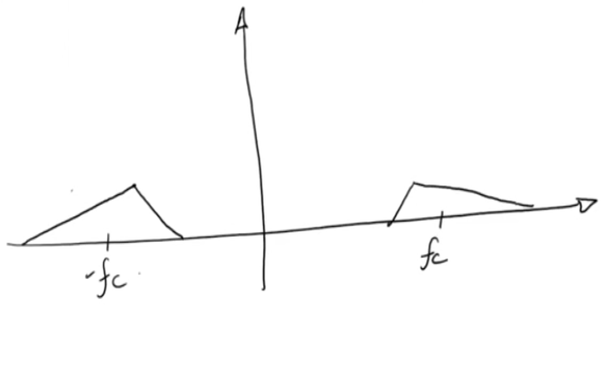

# ECE 531 | Software Defined Radio

## Fourier Transform Review

Fourier Transform Equation
$$X(f) = \int_{-\infty}^{\infty} x(t) e^{-2\pi f t}dt$$

Omega to Frequency Conversion
$$\omega = 2 \pi f$$

Inverse Transform
$$x(t) = \frac{1}{2\pi}\int_{-\infty}^{\infty}X(f) e^{2\pi f t}df$$

#equations

### Example Fourier Transforms 

Example 1 | Fourier Transform of a Delta Function
$$\mathfrak{F}\{\delta (t)\} = 1$$

-  A very short time function is a very wide frequency function.

Example 2 | Boxcar Function

$$\mathfrak{F}\{\Pi(t)\} = sinc(\pi f) =\frac{sin(\pi f)}{\pi f }$$

- Something that is finite in time is going to be infinite in frequency.

Example 3 | Signum/Sign Function

$$\mathfrak{F}\{ sgn(t)\} = \frac{1}{j \pi f}$$

Example 4 | Unit Step Function

$$\mathfrak{F}\{u(t)\} = \frac{1}{2}\delta(f) + \frac{1}{j 2 \pi f}$$

### Properties of the Fourier Transform
#properties 
**Property 1 | Linearity**

$$\alpha_{1}x_{1}(t) + \alpha_{2}x_{2}(t) = \alpha_{1}X_{1}(f) + \alpha_{2}X_{2}(f)$$

**Property 2 | Duality **

$$x(t) \longleftrightarrow X(f)$$
$$X(t) \longleftrightarrow x(-f)$$

Application of this property: 

$$x(t) = \text{rect}(t) \longleftrightarrow sinc(\pi f) = X(f)$$
$$sinc(\pi t) \longleftrightarrow \text{rect}(-f) = rect(f)$$

Again:

$$\delta(t) \leftrightarrow 1$$
$$1 \longleftrightarrow \delta(-f) = \delta(f)$$

**Property 3 | Time Shift Property**

$$x(t - t_{0}) \longleftrightarrow X(f) = e^{- j 2 \pi t_{0} f}$$

**Property 4 | Frequency Shift (modulation property)**

$$x(t) e^{j 2 \pi f_{0} t} \longleftrightarrow X(f- f_{0})$$

- The complex sinusoid multiplying the function can be thought of as a carrier frequency. 

 

$$ cos(f_{1}x) \times sin(f_{2}) = \frac{1}{2}(sin(f_{1}- f_{2}) + sin(f_{1}+ f_{2}))$$

Using a $cos$ wave instead:

$$cos(f_{1}x) \times sin(f_{2}) = \frac{1}{2}(cos(f_{1}- f_{2}) + cos(f_{1}+ f_{2}))$$

**Property 5 | Time Scaling Property**

$$x(at) \longleftrightarrow \frac{1}{|{a}|}X\left(\frac{f}{a}\right)$$

**Property 6 | Convolution Property**

$$x(t) * h(t) \longleftrightarrow X(f)H(f)$$

Convolution in the time domain is multiplication in frequency the frequency domain.

Recall the formula for convolution:
$$x(t)*h(t) = \int x(\tau) h(t-\tau)d\tau$$

Applications: 
- Filtering
- FIR Filter Operation
- Matched Filters: Matching against a template
- Correlation
- etc.

**Property 7 | Parseval's Theroem**

$$\int_{-\infty}^{\infty}|x(t)|^{2}dt = \int_{-\infty}^{\infty} |X(f)|^{2}df$$

Energy is equivalent in both domains.

Fourier Transform of a Periodic Signal

$$X(f) = \sum\limits_{n=-\infty}^{\infty} X_{n} \delta(f - nf_{0})$$

$$X_{n}= \text{Fourier Series Coefficients}$$

We multiply our function with a train of delta functions (at our sample rate)

## Complex Envelope and Quadrature Sampling

Consider the following real analytic signal:

- Looking at thefrequency response of a real signal will render repeating frequencies centered at the oscillator frequency that repeat at integer multiples of the sampling frequency.

Create the "pre-envelopre" signal (analytic signal)
1. Multiply by 2
2. Delete the negative frequencies

$$z(f) = 2 u(f) X(f)$$

$$u(t): \text{Unit Step}$$
$$X(f): \text{real signal}$$

Resulting Signal

Taking this into the time domain:

$$z(t) = 2 [\mathfrak{F}^{-1}\{u(f)\} * x(t)]$$

From example 4:

$$u(t) \longleftrightarrow \frac{1}{2}\delta (f) + \frac{1}{j 2 \pi f}$$

And by Duality

$$\frac{1}{2}\delta (f) + \frac{1}{j 2 \pi t} \longrightarrow u(-f)$$

or

$$u(f) \longleftrightarrow \frac{1}{2}\delta(t) + \frac{j}{2\pi t}$$

Now we can plug that into the anlaytic signal above:

$$z(t) = 2\left[x(t) * \left(\frac{1}{2}\delta\left(t\right) + \frac{j}{2\pi t}\right)\right]$$

Simplifying:

$$z(t) = x(t) + j \frac{1}{\pi t} * x(t)$$

$$\text{Hilbert Transform: }\frac{1}{\pi t} * x(t)$$

Since $\frac{1}{\pi t} \longleftrightarrow -j \text{sig}(f)\begin{numcases}= -j & f>0 \\ 0 &f = 0 \\ j & f < 0\end{numcases}$

Hilbert Transform is achieved through the use of a Quadrature Filter:

$$H(f) = -j \text{sign}(f)$$

For a complex envelope (or a base band signal, or a low pass signal) we want to shift the spectrum of the complex envelope to the left by the center frequency of our response.

We want to take our our analytic signal and shift it to baseband.

We want to stake our signal and shift it such that it is centered at 0 .

Using the frequency shift property:
$$X_{BB}(f) = Z(f+f_{c})$$

$$x_{BB}(t) = z(t) e^{-j 2 \pi f_{c}t}$$

In general, $x_{BB}(t) = X_{I}(t) + j X_{Q}(t)$

This is the rectangular form of the complex number above.

Let's say we have a frequency response that is in the frequency range of 1GHx. This may be tough to sample with an ADC, we want to be able to sample this at twice the highest frequency of interest, so typically, we may take this down to an intermediate frequency that is easier to sample with an ADC. If we take the signal down to baseband, we can take advantage of the fact that we are sampling at the bandwidth that is directly proportional to our sampling rate. We can only achieve this baseband if we can get rid of the negative frequency. 

Using Quadrature sampling, we can sample our signal such that we can sample a signal at a lower rate that at twice the bandwidth of interest. 
