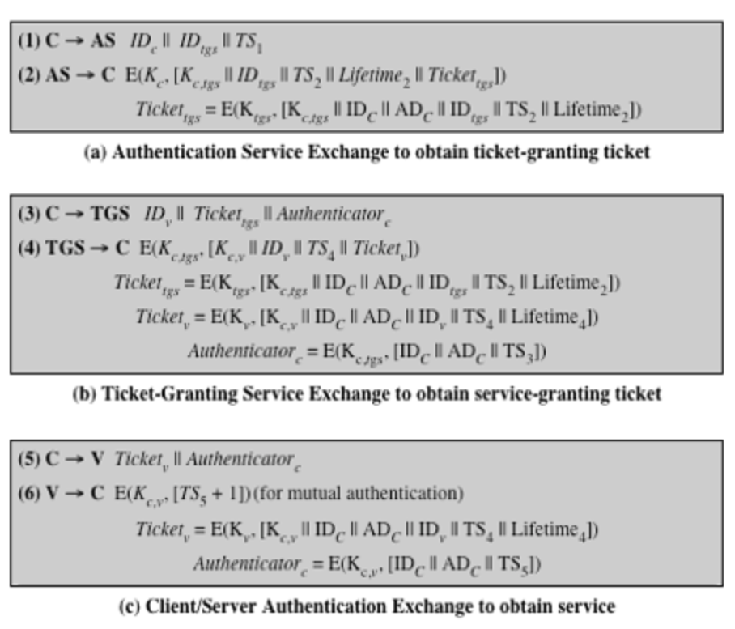

# Kerberos

One of the most important protocols to date use use in computer networks.

## Kerberos Synopsis

Purpose: authentication in distributed system.

## Replicated KDCs

Purposes

- Prevent single point failure
- Prevent performance bottleneck

Multiple KDCs

- Once `master copy` for read/write
- Multiple replicas for read only
- All having the same database and same master key

Updating KDC database

- KDC's database is transferred in clear.
- Privacy: keys are stored as ciphertext encrypted by KDC's master key.
- Integrity: a cryptographic hash of the database file and a timestamp.

## Realms

To scale to a large network including multiple administrations, the principles
are divided into `realms`. Each realm has its own KDC.

The KDCs of other realms are treated as resources (principals) of a local realm.

## Kerberos v4 vs v5

v4 does not allow authentication forwarding

v5 allows the negotiation of sub-session keys.
