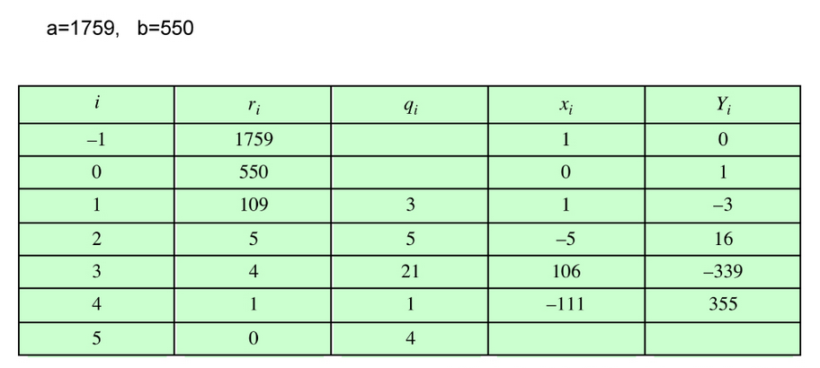
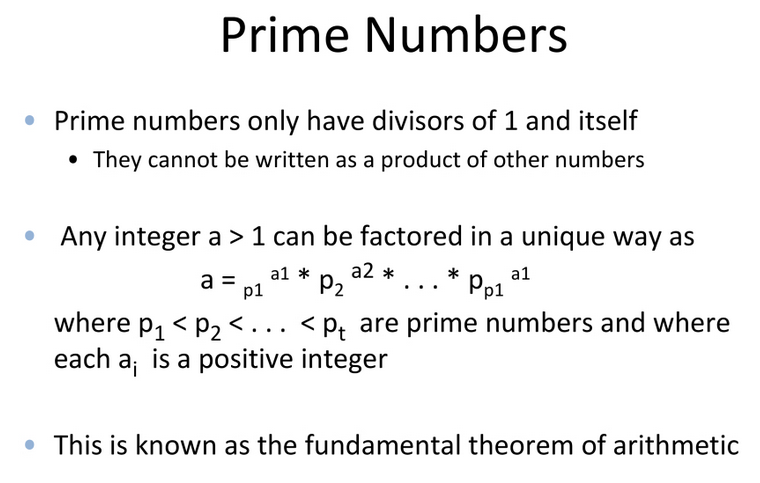
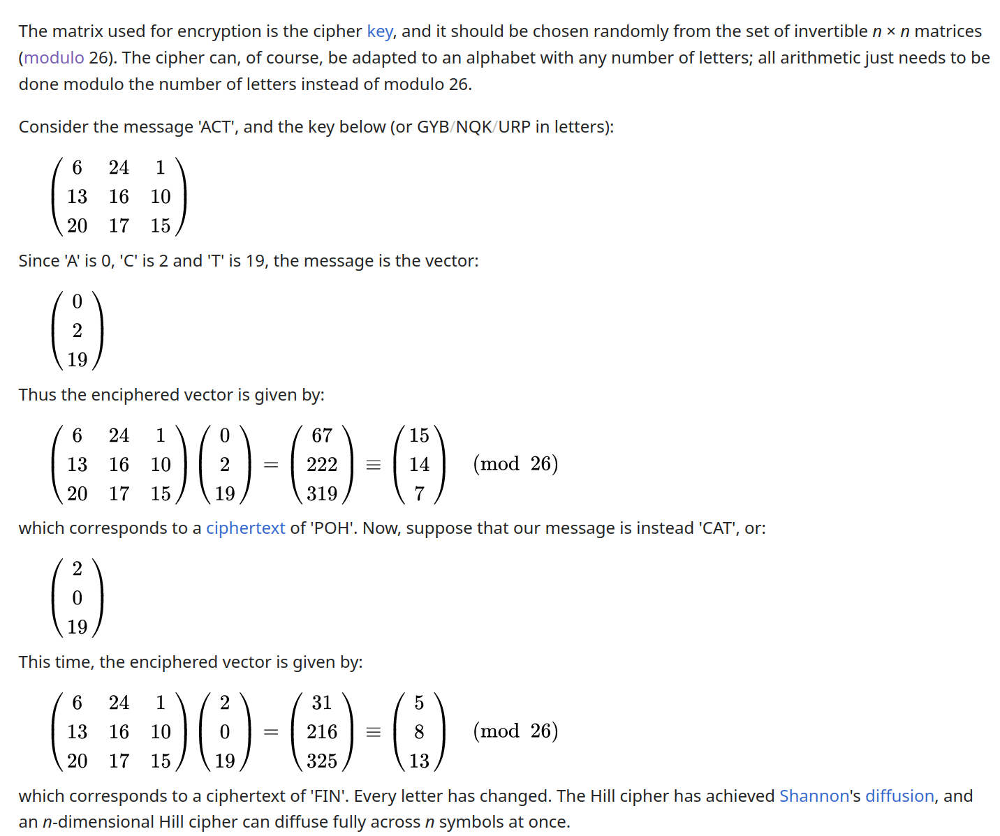
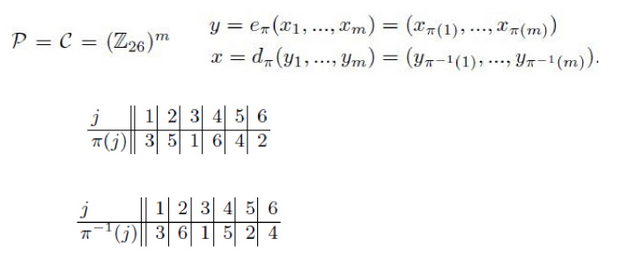
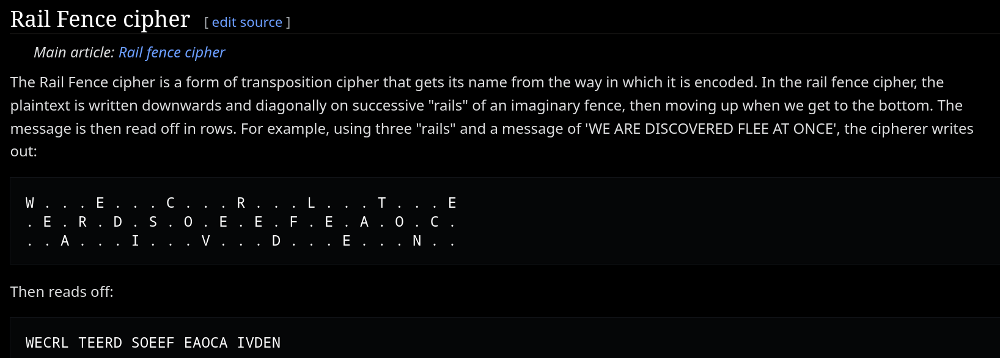
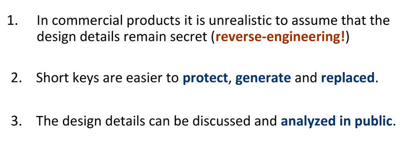
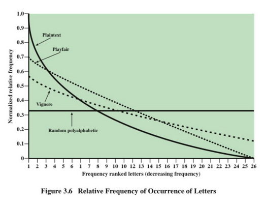

# ECE 571 | Lecture 1

## Notions of Security

There are multiple ways to implement security.

- Adding a lock to a door
- Add a watermark to a bank note
- Hieroglyphics in ancient egypt.

# ECE 571 | Lecture 2

## Security Objectives, Modular Arithmetic

### Information and Network Security

- Information Security

  - Commodity distributed via a network.
  - Security of data on a network or device.

- Network Security

  - Protection of the network availability to enable infrastructure for
    distributing information.
  - For example: preventing DoS attacks.

### Security Attacks

Passive Attacks

- Eavesdropping
- Traffic Analysis
- Packet Sniffing

Active Attacks

- Masquerade/Impersonation

  When Alice is being impersonated by the malicious actor.

  I.e. Mallory is trying to connect to alice, but Bob says that they are Alice,
  so Mallory connects to Bob.

- Insertion/Injection

When Alice wants to send \$1.00 to Bob, but Mallory injects a message and makes
it appear (to Bob) that Alice sent \$100.00 as well.

- Modification

A combination of Masquerading and Insertion/Injection attacks, aka
'Man-In-The-Middle' attacks.

- Delay

A message may be time sensitive. The message must be sent at 10:00 AM, but the
attacker delays the message until 11:00 AM

- Replay

The attacker repeats a previous message that was already sent. So the receiver
will have to messages sent at different times.

- Deletion

### Security Objectives (Services)

- Confidentiality

Restricting access to information only to authorized entities.

- Id Authentication

Association of an identity to an entity.

- Message Authentication

Association of a message to an entity, i.e. verifying the source of a message.

- Data Integrity

Ensuring that the information has not been altered by an unauthorized entity.

- Non-repudiation

Preventing the denial of previous commitment or actions (think of a contract).

- Access Control

Preventing unauthorized use of a resources (e.g. systems and applications)

- Availability

Ensuring the accessibility of a system or resource by an authorized entity.

- Certification

Endorsement of information by a trusted entity

- Privacy and Anonymity

Keeping data, whereabouts, associations, identity, etc. private.

- Freshness

Ensure that the information sent is fresh.

- Revocation

Retraction of certification or authorization.

## Model of Secure Communication

Senders and recipients sent messages through an information channel. The channel
is assumed to be insecure.

Sender --> Message --> Security Related Transformation --> Secure Message -->
Sent through the information channel --> Sent message gets transformed back to
the original message --> received by the recipient.

Network Access Security Model:

There is a computing resource that has data, processes, or software present on
the resource. You need to protect the resource from actors that are trying to
access the resource.

The opponent could be a human, or a software. Techniques to assist in this
`Gatekeeper` function, can be things like gateways and firewalls.

# ECE 571 | Lecture 3

## Modular Arithmetic and Crypto-systems

Date: 2024-01-17

## Basic Modular Arithmetic

### Division

- Divisibility: A nonzero $b$ divides $a$ if $a=md$ for some $m$ (all are
  integers)
  - If $b|a$ then $b$ is a divisor of $a$

Properties of Divisibility:

- If $a|b$ and $b|c$ then $a|c$
- If $b|g$ and $b|h$ then $b | (mg + nh)$ for arbitrary integers $m$ and $n$

Division Algorithm:

- Given any positive integer $n$, integer $a$: $a = qn + r$,$0 \le r < n$, $p =
  \text{floor}(\frac{a}{n})$ where q is the quotient and r is the residue
  (remainder).

Modulus

$a$ mod $n$: the remainder when $a$ is divided by $n$.

Congruence

if $a$ mod $n$ = $b$ mod $n$: $a$ $\equiv$ $b$ mod $n$

Properties of Modulo

- $a \equiv b$ mod $n$ iff $n | (a-b)$
- $a \equiv b$ mod $n$ iff $b \equiv a$ mod $n$
- $a \equiv b$ mod $n$ and $b \equiv c$ mod $n$ ==> $a \equiv c$

Modular Addition and Multiplication

- Arithmetic operations within the set $Z_{n} = \{0, 1, 2, ..., (n-1)\}$

![[Pasted image 20240117133935.png]]

<!-- TODO: Figure out the modulo of numbers raised to a power modulo something. -->

Additive Identity (A.I.)

[Additive Identity](https://en.wikipedia.org/wiki/Additive_identity)

Additive and Multiplicative Inverse

[Multiplicative Inverse](https://en.wikipedia.org/wiki/Multiplicative_inverse)

### Additive and Multiplicative Inverse

Multiplicative Identity

$a \cdot 1 \equiv a \text{mod}(n)$

Multiplicative Inverse

$a \cdot b = 1 \text{mod}(n)$

When multiplying a and b, the modulo of the n is equal to 1.

Relatively Prime

$a$ is relatively prime with $n$ if $\text{GCD}(a,n) = 1$

Multiplicative inverse exists iff #TODO

# ECE 571 | Lecture 4

01/19/2024

## Greatest Common Denominator

GCD(a, b) = 1 if the numbers are relatively prime.

## Euclidean Algorithm

[Euclidean Algorithm](https://en.wikipedia.org/wiki/Euclidean_algorithm)

This is an algorithm to find the GCD between two numbers quickly using module
math.

The GCD(a,b) is GCD(a, b mod(a)) recursively.

GCD(55,22) = GCD(b, a mod(b)) = GCD(22, 11) = GCD(11, 0) = 11

### Extended Euclidean Algorithm

[Extended Euclidean Algorithm](https://en.wikipedia.org/wiki/Extended_Euclidean_algorithm)

![[Pasted image 20240119134420.png]]

e.g.

$$a=42$$ $$b=30$$

The formula for the iterations is:

$$x_{i} = x_{i-2}-q_{i}\cdot x_{i-1}$$ $$y_{i} = y_{i-2}-q_{i}\cdot y_{i-1}$$

Given these initial conditions, lets make the table:

$$x_{-1}=1$$ $$y_{-1}=0$$

| $i$ | $r_{i}$ | $q_{i}$ | $x_{1}$ | $y_{i}$ |
| --- | ------- | ------- | ------- | ------- |
| -1  | $a=42$  |         | 1       | 0       |
| 0   | $b=30$  |         | 0       | 1       |
| 1   | 12      | 1       | 1       | -1      |
| 2   | 6       | 2       | -2      | 3       |
| 3   | 0       | 2       | X       | X       |

After we get to $i=3$ we have arrived at the solution.

$$\text{GCD}(42, 30) \text{ is } 6.$$

The difference between the normal and extended euclidean algorithm is contained
in the $y$ coefficient. This is the multiplicative inverse. So you only need to
apply this the extended algorithm when the $\text{GCD}$ is 1.

Here is a table of larger numbers:



In this case, the multiplicative inverse is 355. (The final $Y_{i}$ before the
remainder is 1. )

# ECE 571 | Lecture 5

01/22/2024

## Prime Numbers

## Classical Cryptography



Send information securely over an insecure (public) channel.

Symmetric and Asymmetric key cryptography.

- Symmetric: When the same key is used for encryption and decryption.
- Asymmetric: When one key is used for encryption and another key is used for
  decryption.

A crypto-system is a 5-tuple (P,C,K,E,D)

1. P is the set of possible plain texts
2. C is the set of possible ciphers
3. K is the set of possible keys
4. E is the encryption rule set
5. D is the decryption rule set

### Early Ciphers

Substitution: letters of the plain text are replaced by other letters or by
numbers or symbols. The goal is to make it difficult to determine how a message
and key were transformed.

- Mono-alphabetic Ciphers:

  - Shift ciphers: shift the letters that are used in the alphabet.
  - Substitution ciphers: change the letter with another letter in the key.
  - Affine cipher: scales and then shifts the value to encrypt the message.
    [Affine Cipher](https://en.wikipedia.org/wiki/Affine_cipher)

- Poly-alphabetic Cipher

  - Vigenere Cipher: basically multiple substitution alphabets are used instead
    of one substitution alphabet.
  - Hill cipher

them.

## **Affine Cipher**

Encryption:

Decryption:

How do you select a and b for use in the affine cipher?

$a$ and $b$ must be relatively prime.

$GCD(a,26 = 1)$

if $a = 2$, $b = 0$, $y = 2x mod26$

$y=x\text{mod}26$, $x \in Z_{26}$, $y \in Z_{26}$

Encryption must be one-to-one mapping.

### What is the cardinality of the Key Space for the Affine Cipher?

if n is prime:

- $\phi (n) = n - 1$
- $n = p \times q$
- $\phi(n) = (p-1) \times (q-1)$
- $n = 26 = 2 \times 13$
- $\phi(26) = 1 \times 12 = 12$
- $n = 10 = 2 \times 5$
- $\phi(10) = 1 \times 4 = 4$
- $1, 2, 7, 9$ co-prime with $4$

In general:

## Totient Function

[Fundamental Theorem of Arithmetic](https://en.wikipedia.org/wiki/Fundamental_theorem_of_arithmetic)

Gives us the
[Euler Totient Function](https://en.wikipedia.org/wiki/Euler%27s_totient_function)

The totient function is a function that gives the number of prime numbers that
are contained in the set up to the input number.

There are three situations that you'll run into when $\Phi(k)$ is used.

- $k$ is prime: $\Phi(k) = k-1$
- $k$ can be expressed as $n^{m}$: $\Phi(n^{m}) = n^{m} - n^{m-1}$
- $k$ is composite: $\Phi(knm) =\Phi(k)\Phi(n)\Phi(m)$
  - In this case, you get the prime factorization of all of the input, then you
    take use the second situation to calculate this phi.

# ECE 571 | Lecture 6

## Early Ciphers and Cryptanalysis

### Substitution Ciphers

In the substitution cipher, the key can be any permutation of the 26 alphabetic
character.

There are $26!$ possible keys, this may take some time to brute force, however,
there are other methods of cracking ciphers that make this easier to crack than
first suspected.

In this case, one of those methods is the use of Frequency Analysis.

> [Frequency Analysis](https://en.wikipedia.org/wiki/Frequency_analysis): The
> study of the frequency of letters or groups of letters in a cipher.

The use of frequency analysis let's us exploit the regularities of the language
and counting letter frequencies.

### Vigenere Cipher

The Vigenere cipher is the best well known Poly-alphabetic cipher. The key is an
m-length vector. Use different mono-alphabetic substitutions as one proceeds
through the plaintext message.

Example: "deceptive"; plaintext: "we are discovered save yourself"

```
key:        deceptivedeceptivedeceptiv
plaintext:  wearedicoveredsaveyourself
```

### Hill Cipher

This encryption algorithm takes $m$ successive plaintext letters and substitutes
for them $m$ cipher-text letters.

To encrypt a message, each block of n letters (considered as an n-component
vector) is multiplied by an invertible n × n matrix, against modulus 26. To
decrypt the message, each block is multiplied by the inverse of the matrix used
for encryption.



A matrix is a valid key matrix iff the determinant of the key matrix has a
multiplicative inverse.

The inverse key matrix i

Calculating the Inverse Key Matrix for the Hill Cipher.

Given a $K$ matrix:

$$\begin{pmatrix} 5 && 8 \\ 17 && 3 \end{pmatrix}$$

The inverse matrix can be calculated as follows:

$$\text{det}K = 5\times3 - 17\times 8 = 9 \text{mod}(26) = 9 $$

$$\text{GCD}(9, 26) = 1)$$

$$9^{-1} \text{mod}26 = 3$$

$$
K^{-1} = 3 \begin{pmatrix} 3 && -8 \\ -17 && 5 \end{pmatrix} =
\begin{pmatrix} 9 && 2 \\ 1 && 15 \end{pmatrix} \text{mod}26
$$

# ECE 571 | Lecture 7

01/26/2024

## Block Ciphers vs Stream Ciphers

- Block Ciphers have to wait for in input stream to fill a block before the
  encryption can be completed.

- Stream Ciphers can encrypt single characters of the plaintext with a different
  key.

### Stream Ciphers

- The [Vernam Cipher](https://en.wikipedia.org/wiki/Gilbert_Vernam)

The key must be as long as the message, lest you re-use the key

### Permutation Ciphers

- [Permutation](https://en.wikipedia.org/wiki/Transposition_cipher) (also called
  transposition) ciphers focus on 'diffusion' instead of 'confusion' in the
  message.
- Diffusion: widely spreading the information from the message or the key across
  the cipher-text



- The rail fence cipher is a cool example of a permutation cipher as well.



- Columnar Transpositions are another example.

## Cryptanalysis

> What is the goal of cryptanalysis?

The goal of cryptanalysis is to decipher messages. This involves discovering the
algorithm that was used to encrypt the plaintext as well as discovering the key
that was used.

### Kerckhoffs' Principle

> The cipher should remain secure even if the adversary knows the specification
> of the cipher.

- In commercial products, it is unrealistic to assume



# ECE 571 | Lecture 7

## Attack Models

- Cipher-text-only attack: Eve only observes the cipher-text
- Known-plaintext attack: Eve only knows some plaintext x and its corresponding
  cipher-text y
- Chosen-plaintext attack: Eve has temporary access to an encryption box.
  - It can feed any chosen plaintext x and obtain the cipher-text y
- Chosen-cipher-text attack: Eve has temporary access to a decryption box.
  - It can feed any chosen cipher-text y and obtain the plain-text x.

Attack models are important when wanting to prove if certain encryption schemes
are secure. An encryption scheme is only as secure as its least powerful attack
that it is susceptible to.

Example: Perform each type of attack on a shift cipher. Comment on the
complexity of performing each attack.

Plaintext x: shift cipher-text y: vkliw

### Affine Cipher

[Affine Cipher | Wikipedia](https://en.wikipedia.org/wiki/Affine_cipher)

### Hill Cipher | Cryptanalysis

[Hill Cipher | Wikipedia](https://en.wikipedia.org/wiki/Hill_cipher)

The hill cipher is difficult to break with a cipher-text-only attack.
Example:

cipher-text: PQCFKU

plain-text: friday

_CPA_

$$y_{1} = (15 16)^{T}$$ $$y_{2} = (15 16)^{T}$$

$$x_{2} = (5 17)^{T}$$ $$x_{2} = (8 3)^{T}$$

$$Y = K X$$

$$Y = X^{-1} = k X X^{-1}$$

$$x =\begin{pmatrix}5 && 8 \\ 17 && 3 \end{pmatrix}$$ $$Y =\begin{pmatrix}16 &&
2 \\ 16 && 5 \end{pmatrix}$$


### Cryptanalysis of the Vignere Cipher 

Known-plaintext attack, Chosen-plaintext attack, Chosen-cipher-text attack

If you know the plaintext, the vignere cipher is akin to a shift cipher. 


Cipher-text-only attack 


### Frequency Distribution Analysis of Different Ciphers 





### Cryptanalysis of the Vignere Cipher 

Observation: consists of multiple monoalphabetic ciphers 

Method:

- 


