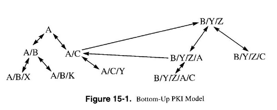

# Public Key Infrastructure

Question: How does Alice know that the public key she received is actually Bob's
key?

We can solve this problem using a Certificate and CA (Certificate Authority)

- Certificates are a signed public key
- Certificate Authority is a trusted entity that has the ability to provide
  certificates. (Everyone trusts the CA, also known as a "root of trust"")

# Certificate Revokation

Everyone in the group has a trust relationship with the CA. The CA can extend
this trust relationship by issuing certificates to another entity, A. This let's
A have the trust of the people who trust the CA, B.

There are situations where a certificate may want to be revoked, such as:

- When A leaves the group
- A certification revocation list (CRL) periodically revokes all the of the
  certificates that are on that list.

Note: B only accepts A's certificate only when it has a valid CA signature, has
not expired, and is not in the CA's most recent CRL.

# Public Key Infrastructure (PKI)

- The task of a PKI is to securely distribute public keys.
- A PKI allows different parties to authenticate each other _without prior
  contact or having to exchange any secret information in advance_

A PKI consists of:

- Certificate Issuance
- A repository for retrieving certificates
- A method of revoking certificates
- A method of evaluating a chain of certificates from a trust anchor to the
  target name. (Have the ability to verify certificates from many different CAs)

# Hierarchical Approach (Trust Model a CA)

Having a single CA to certify every public key is impractical.

Instead, we can use a trusted _root authority_ (for example, verisign), where
everyone must know the public key for verifying the root authority's signatures.

Root authorities sign certificates for lower level authorities, lower-level
authorities sign certificates for individual networks, and so on... In other
words, we can create a certificate chain instead of a single certificate.

$sig_{verisign}(UA, PK_{UA}), sig_{UA}(Alice, PK_{Alice})$

# Web Of Trust (Another Trust Model for CA)

Used in PGP (Pretty Good Privacy)

Instead of a single root of authority, each person has a set of keys they
"trust".

This allows trust to be transitive (a friend of a friend of a friend can be
trusted).

Tophat Question: In a Web of Trust system such as PGP (Pretty Good Privacy), how
can trust be established between parties?

Answer: By individuals having a set of keys they trust and using signatures from
these keys to validate others.

There are multiple models of trust for a CA:

- Monopoly Model
- Monopoly plus Registration Authorities
- Delegated CAs
- Oligarchy
- Anarchy Model
- Top-Down with Name constraints
- Bottom-Up with Name constraints

# Monopoly Model

In this model, there is a single CA that is the sole trust anchor of all
certificates.

In the Monopoly plus Registration Authorities model, the CA issues certificates,
but delegates verification to registration authorities (RAs).

# Delegated CAs

(This is the hierarchical model)

# Oligarchy Model

- Multiple trust anchor CAs are pre-configured in all principles
- The user has the option to modify the list of trust anchor CAs
- Commonly used in browsers (SSL/TLS)

Advantages: there is not a single point of failure Disadvantages: the user has
to decide who to trust

# Anarchy Model

This is a peer-to-peer model for trust.

- Each principal selects a set of peers as trust anchors.
- Principals sign each others' certificates
- If a chain of trust can be found from a trust anchor to a target name, then
  the public key of the target is verified.
  - Used by PGP.

# Top-Down with Name constraints

Each CA only is only trusted for for signing a subset of users.

Similar to a DNS hierarchy, each domain may have a CA server. The CA of the
parent domain (arizona.edu) generates certificates for the CAs responsible for
the sub domains (ece.arizona.edu)

# Bottom-Up with Name constraints

A parent CA and child CA generate certificates for each other.

Two CAs without a parent-child relationship may generate a certificate, known as
a cross-certificate.

The trust paths start from a trust anchor then follow links to the the node you
want to verify.

Tophat Question: Using this bottom-up PKI model, suppose A/B/X is NOT
pre-configured with A's public key. If it wants to verify the public key of
A/C/Y. How many certificates does A/B/X need to verify at least? (assuming we
count the self-signatures).

Answer: 4

