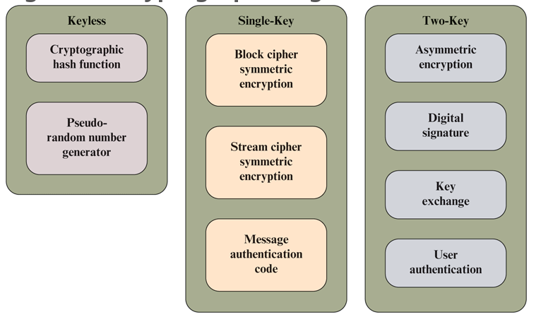
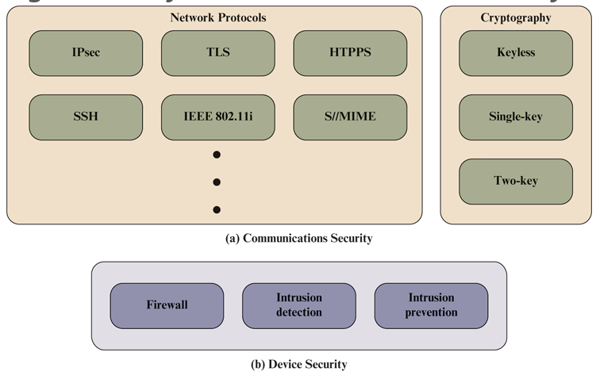

# Chapter 1

Learning Objectives After studying this chapter, you should be able to:

- Describe the key security requirements of confidentiality, integrity, and
  availability.
- Discuss the types of security threats and attacks that must be dealt with and
  give examples of the types of threats and attacks that apply to different
  categories of computer and network assets.
- Provide an overview of keyless, single-key, and two-key cryptographic
  algorithms.
- Provide an overview of the main areas of network security.
- Describe a trust model for information security.
- List and briefly describe key organizations involved in cryptography
  standards.

## Cybersecurity, Information Security, and Network Security

Cyber Security: The protection of information that is stored transmitted and
processed in a networked system of computers.

Subsets of Cybersecurity:

- Information Security:

  Confidentiality, Integrity, and Availability of Information

- Network Security:

  Protection of networks from unauthorized modification, destruction, and
  disclosure. Ensure that the network can perform critical duties.

Security Objectives

- Confidentiality:

  Data confidentiality: Ensure that private or confidential information is not
  made available to unauthorized parties.

  Privacy: Individuals control or influence what information related to them may
  be collected and stored by whom and to whom that information may be disclosed.

The Challenges of Information Security

- Integrity:

  Data integrity: Ensures that data and programs are indeed what they claim to
  be and can only be changed in authorized manners and only by authorized
  individuals.

  System integrity: Assures that a system performs its intended function in an
  unimpaired manner.

- Availability:

  Assures that systems work promptly and service is not denied to authorized
  users.

  CIA Triad:

  - Confidentiality
  - Integrity
  - Availability

## The OSI Security Architecture

A standardized way of evaluating security products and policies.

Security attack: any action compromises the information owned by an
organization.

Security Mechanism: A process or device designed to detect, prevent, or recover
from a security attack.

Security Service: A processing or communication service that enhances the
security of the data processing systems and the information transfers of an
organization.

Threat: Any circumstance or event with potential to adversely impact
organizational operations, assets, individuals, other organizations, or the
Nation through an information system via unauthorized access, destruction,
disclosure, modification of information, and/or denial of service.

Attack: Any kind of malicious activity that attempts to collect, disrupt, deny,
degrade, or destroy information systems of the information itself.

### Passive vs Active Attacks

Passive Attacks are in the nature of eavesdropping on, or monitoring of,
transmissions.

Two types of passive attacks are:

- Release of message contents
- Traffic analysis: looking at the message contents and/or communication nature.

Passive attacks are more difficult to detect since they don't alter the data.

Active attacks involve some modification of the data stream or creation of a
false stream.

Active attacks belong in one of four categories:

- Masquerade: one entity pretends to be another entity.
- Replay: passive capture of a data unit and its subsequent retransmission in
  order to produce an unauthorized effect.
- Modification of messages: modifying messages occurring within the targeted
  communication channel.
- Denial of service: prevent, or inhibit the normal use of management of
  communication facilities.

## Security Services

A security service is a capability that supports one or more of the security
requirements (confidentiality, integrity, availability, authenticity, and
accountability).

- Authentication: assuring that communication is authentic.
- Access Control: ensuring that access is only provided to authorized
  individuals.
- Data Confidentiality: protection of data from passive attacks.
- Data Integrity: messages that are received are set with no duplication,
  insertion, modification, reordering, or replays.
- Non-repudiation: prevents the sender or the receiver from denying a
  transmitted message.
- Availability Service: Property of a system or resource being available upon
  demand form an authorized agent.

## Security Mechanisms

- Cryptographic algorithms
- Data integrity:
- Digital signature
- Authentication exchange
- Traffic padding
- Routing control
- Notarization
- Access control

## Cryptography

- Keyless Algorithms: do not use keys during transformations
- Single-Key Algorithms: one secret key is used to encode and decode
  information.
  - Block ciphers: operate on a data as a sequence of blocks.
  - Stream cipher: Operates on a data as a sequence of bits.
- Two-Key Algorithms: (Asymmetric Encryption) At various stages, two different,
  but related keys are used, referred to as public and private keys.
  - One key is used to encode the message, and the other key is used to decode
    the message. Depending on how the implementer wants the information to be
    dispersed, the public key and private keys serve difference purposes.

## Network Security

- Communications Security: protection of communications through the network,
  usually implemented in network protocols.
- Device Security: protection of devices connected to a network. Implemented
  using firewalls, intrusion detection systems, and intrusion prevention
  systems.

## Trust and Trustworthiness

Trust: The willingness of a party to be vulnerable to the actions of another
party based on the expectation that the other will perform a particular action
important to the truster, irrespective of the ability to monitor or control that
other party.

Trustworthiness: A characteristic of an entity that reflects the degree to which
that entity is deserving of trust.

Propensity to trust: A tendency to be willing to trust others across a broad
spectrum of situations and trust targets.

Risk: A measure of the extent to which an entity is threatened by a potential
circumstance or event.

A truster uses three factors to establish the trustworthiness of an entity:

- Ability/Competence: The potential ability of the evaluated entity.
- Benevolence: Can you be sure that the evaluated party does not intend to do
  harm?

- Integrity: The truster's perception that the evaluated entity adheres to a set
  of principles the truster finds acceptable.

### The Trust Model and Information Security

Trustworthiness of an individual:

- Human resource security: Policies are in place that ensure that the transfer
  of information is secure.
- Security awareness training: Trainings occur to ensure that humans can
  properly evaluate threats to the security of data.

Trustworthiness of an organization:

Establishing trust with organizations can be done through formally established
means such as a contract or be more complex than a simple relationship with an
individual.

Trustworthiness of an Information System:

- Security functionality: The cryptographic and network security technologies
  utilized by the system.
- Security Assurance: Ensuring that the system is performing correctly by
  conducting security audits.

### Establishing Trust Relationships

## Standards
# Chapter 2

Learning Goals:

- Understand the concept of divisibility and the division algorithm.
- Understand how to use the Euclidean algorithm to find the greatest common
  divisor.
- Present an overview of the concepts of modular arithmetic.
- Explain the operation of the extended Euclidean algorithm.
- Discuss key concepts relating to prime numbers.
- Understand Fermat’s theorem.
- Understand Euler’s theorem.
- Define Euler’s totient function.
- Make a presentation on the topic of testing for primality.
- Explain the Chinese remainder theorem.
- Define discrete logarithms.

The first three sections focus on information in number theory required to work
with finite fields.

- Divisibilty
- Euclidian algorithm
- Modular arithmetic

## Divisibility and The Division Algorithm

### Divisibility

Nonzero b divides a if a = mb for some m, where a, b, and m are integers.

Properties of Divisibility:

- if $a|1$, then $a = \pm 1$

### The Division Algorithm

## The Euclidean Algorithm

### Greatest Common Divisor

### Finding the Greatest Common Divisor

### Modular Arithmetic

### The Modulus

### Properties of Congruences

### Modular Arithmetic Operations

### Properties of Modular Arithmetic

### Euclidean Algorithm Revisited

### The Extended Euclidean Algorithm

## Prime Numbers

## Fermat’s and Euler’s Theorems

### Fermat’s Theorem

### Euler’s Totient Function

### Euler’s Theorem

## Testing for Primality

### Miller–Rabin Algorithm A Deterministic Primality Algorithm Distribution of Primes

## The Chinese Remainder Theorem

## Discrete Logarithms

### The Powers of an Integer, Modulo n Logarithms for Modular Arithmetic Calculation of Discrete Logarithms
