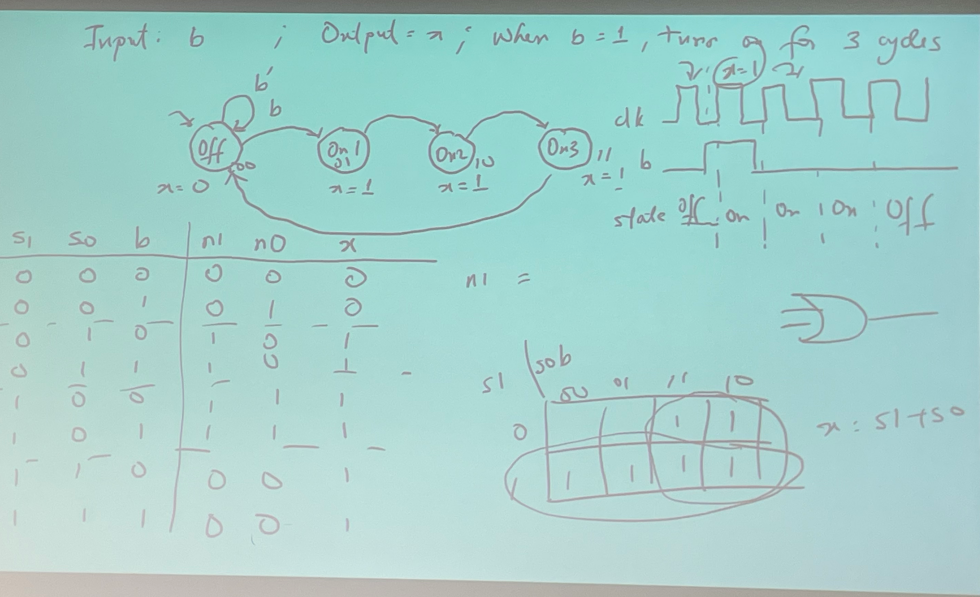

# ECE 574 Lecture 1


## Agenda
- Go over the syllabus.
- Listen to Tosi's jokes about himself.


# ECE 574 | Lecture 1

[Presentation](https://piazza.com/class_profile/get_resource/lr5bhk2semh5k9/lr5s5l9a9165gr)

### Moore's Law

> Doubling of IC capacity every 18 months.

### Increasing Abstraction

Higher abstraction levels simplify designer effort. High level synthesis allows
us to describe systems in ways that are closer to human understanding.

### Combinational Logic Design Process. | Truth Tables to Gates

Design a ROUNDER circuit with a 3-bit input A (represented as three inputs A2,
A1, A0) and a 3-bit output R (represented as three outputs R2, R1, R0) where the
output of the circuit is the input value A rounded up to the nearest multiple
of 2. For example, if the input A is 5 `101`, the output R will be 6 `110`. If
the input A is equal to 7 `111`, then the output should e 0 `000`. Draw the
truth table and provide the Boolean equation for each of the three outputs.

[Gray Code](https://en.wikipedia.org/wiki/Gray_code): The difference between any
two values is just one bit.

| A2  | A1  | A0  | R2  | R1  | R0  |
| --- | --- | --- | --- | --- | --- |
| 0   | 0   | 0   | 0   | 0   | 0   |
| 0   | 0   | 1   | 0   | 1   | 0   |
| 0   | 1   | 0   | 0   | 1   | 0   |
| 0   | 1   | 1   | 1   | 0   | 0   |
| 1   | 0   | 0   | 1   | 0   | 0   |
| 1   | 0   | 1   | 1   | 1   | 0   |
| 1   | 0   | 0   | 1   | 1   | 0   |
| 1   | 1   | 1   | 0   | 0   | 0   |

$$
\begin{bmatrix} && 00 && 01 && 11 && 10 \\ 0 && 0 && 0 && 1 && 0 \\ 1 && 1 &&
1 && 0 &&1 \\ \end{bmatrix}
$$

R2 = A2' A1 A0 + A2 A1' + A2 A0'

R1 = A1' A0 + A1 A0'

// TODO: Add the code that is posted for this class, behavioral vs structural
code.

```verilog
module WhatIsThis(I1, I0, En, D3, D2, D1, D0);

    input I1, I0, En;
    output reg D3, D2, D1, D0;

    always @(I1, I0, En)
    begin

       // Insert behavior here.

    end

    end
endmodule
```


### Parameterized Circuits
[Parameterized ROUNDER](./code-examples/parameterized-rounder.v) 


# Data Path Components

Data components that data passes through that determine what happens to your
data.

Examples of some basic datapath components: Verilog code demo. #TODO: Code shall
be posted by Dr. Adegbija.

- 2x4 decoder
- 4-bit register
- shift register

## Verilog Review

`always @(posedge clk)` is used to synchronize actions on every clock cycle.
`{din, I[3:1]}` is the concatenate operator. `=` is blocking assignment is used
for intermediate values, this is used when variable values are dependent on
other outputs within the module. `signed` is a key word that can be used to
identify signed and unsigned numbers in a piece of hardware.

### Test Benches

- inputs are reg
- outputs are wire
- the modules are called
- set up the clock in an always block.
- provide inputs so that you cna analyze them.

## Finite State Machine

An FSM is a way to describe a system

They are the most common way to model digital systems.

Typically, FSMs are expressed using states and transition conditions that must
be met to transition between states.

In circuits, you Typically have a system that performs some function, so a
'state register' is usually implemented in the hardware as well.

## Critical Path

Input b; Output x; when b = 1, turn on for three cycles

In this case, there are four states in the finite state machine (FSM).

- off: off
  - x = 0
- On1
  - x = 1
- on2
  - x = 1
- on3
  - x = 1

| s1  | s0  | b   | n1  | n0  | x   |
| --- | --- | --- | --- | --- | --- |
| 0   | 0   | 0   | 0   | 0   | 0   |
| 0   | 0   | 1   | 0   | 1   | 0   |
| 0   | 1   | 0   | 1   | 0   | 1   |
| 0   | 1   | 1   | 1   | 0   | 1   |
| 1   | 0   | 1   | 1   | 1   | 1   |
| 1   | 0   | 0   | 1   | 1   | 1   |
| 1   | 1   | 1   | 0   | 0   | 1   |
| 1   | 1   | 0   | 0   | 0   | 1   |



### Sequential Logic Design Process

Create an FSM for a timing verification component that has three inputs
`CStart`, `CEnd`, and `ErrorRst`, and one output `Error`. In a correctly
functioning system, whenever the `CStart` input becomes 1, two cycles later the
`CEnd` signal should become 1 for exactly 1 cycle. The timing verification
controller should assert the output `Error` to 1 whenever this behavior is NOT
observed. The controller will continue to assert the output `Error` to 1 until
the `ErrorRst` input becomes 1, after which the controller should again monitor
the `CStart` and `CEnd` inputs.

Inputs: `CStart`, `CEnd`, `ErrorRst` Output: `Error`


