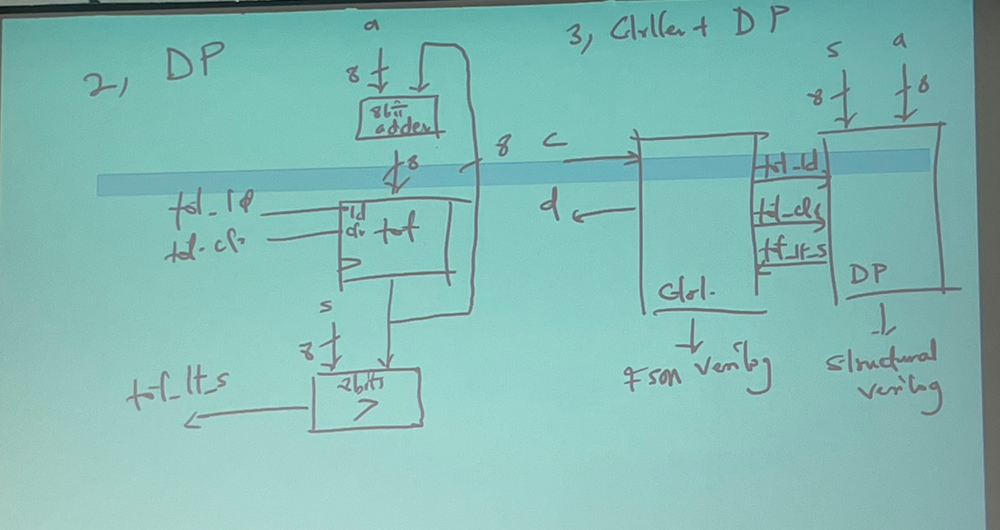

# ECE 574

## Agenda

- Go over the syllabus.
- Listen to Tosi's jokes about himself.

[Presentation](https://piazza.com/class_profile/get_resource/lr5bhk2semh5k9/lr5s5l9a9165gr)

### Moore's Law

> Doubling of IC capacity every 18 months.

### Increasing Abstraction

Higher abstraction levels simplify designer effort. High level synthesis allows
us to describe systems in ways that are closer to human understanding.

### Combinational Logic Design Process. | Truth Tables to Gates

Design a ROUNDER circuit with a 3-bit input A (represented as three inputs A2,
A1, A0) and a 3-bit output R (represented as three outputs R2, R1, R0) where the
output of the circuit is the input value A rounded up to the nearest multiple
of 2. For example, if the input A is 5 `101`, the output R will be 6 `110`. If
the input A is equal to 7 `111`, then the output should e 0 `000`. Draw the
truth table and provide the Boolean equation for each of the three outputs.

[Gray Code](https://en.wikipedia.org/wiki/Gray_code): The difference between any
two values is just one bit.

| A2  | A1  | A0  | R2  | R1  | R0  |
| --- | --- | --- | --- | --- | --- |
| 0   | 0   | 0   | 0   | 0   | 0   |
| 0   | 0   | 1   | 0   | 1   | 0   |
| 0   | 1   | 0   | 0   | 1   | 0   |
| 0   | 1   | 1   | 1   | 0   | 0   |
| 1   | 0   | 0   | 1   | 0   | 0   |
| 1   | 0   | 1   | 1   | 1   | 0   |
| 1   | 0   | 0   | 1   | 1   | 0   |
| 1   | 1   | 1   | 0   | 0   | 0   |

$$
\begin{bmatrix} && 00 && 01 && 11 && 10 \\ 0 && 0 && 0 && 1 && 0 \\ 1 && 1 &&
1 && 0 &&1 \\ \end{bmatrix}
$$

R2 = A2' A1 A0 + A2 A1' + A2 A0'

R1 = A1' A0 + A1 A0'

// TODO: Add the code that is posted for this class, behavioral vs structural
code.

```verilog
module WhatIsThis(I1, I0, En, D3, D2, D1, D0);

    input I1, I0, En;
    output reg D3, D2, D1, D0;

    always @(I1, I0, En)
    begin

       // Insert behavior here.

    end

    end
endmodule
```

### Parameterized Circuits

[Parameterized ROUNDER](./code-examples/parameterized-rounder.v)

## Data Path Components

Data components that data passes through that determine what happens to your
data.

Examples of some basic datapath components: Verilog code demo. #TODO: Code shall
be posted by Dr. Adegbija.

- 2x4 decoder
- 4-bit register
- shift register

## Verilog Review

`always @(posedge clk)` is used to synchronize actions on every clock cycle.
`{din, I[3:1]}` is the concatenate operator. `=` is blocking assignment is used
for intermediate values, this is used when variable values are dependent on
other outputs within the module. `signed` is a key word that can be used to
identify signed and unsigned numbers in a piece of hardware.

### Test Benches

- inputs are reg
- outputs are wire
- the modules are called
- set up the clock in an always block.
- provide inputs so that you cna analyze them.

## Finite State Machine

An FSM is a way to describe a system

They are the most common way to model digital systems.

Typically, FSMs are expressed using states and transition conditions that must
be met to transition between states.

In circuits, you Typically have a system that performs some function, so a
'state register' is usually implemented in the hardware as well.

## Critical Path

Input b; Output x; when b = 1, turn on for three cycles

In this case, there are four states in the finite state machine (FSM).

- off: off
  - x = 0
- On1
  - x = 1
- on2
  - x = 1
- on3
  - x = 1

| s1  | s0  | b   | n1  | n0  | x   |
| --- | --- | --- | --- | --- | --- |
| 0   | 0   | 0   | 0   | 0   | 0   |
| 0   | 0   | 1   | 0   | 1   | 0   |
| 0   | 1   | 0   | 1   | 0   | 1   |
| 0   | 1   | 1   | 1   | 0   | 1   |
| 1   | 0   | 1   | 1   | 1   | 1   |
| 1   | 0   | 0   | 1   | 1   | 1   |
| 1   | 1   | 1   | 0   | 0   | 1   |
| 1   | 1   | 0   | 0   | 0   | 1   |


### Sequential Logic Design Process

Create an FSM for a timing verification component that has three inputs
`CStart`, `CEnd`, and `ErrorRst`, and one output `Error`. In a correctly
functioning system, whenever the `CStart` input becomes 1, two cycles later the
`CEnd` signal should become 1 for exactly 1 cycle. The timing verification
controller should assert the output `Error` to 1 whenever this behavior is NOT
observed. The controller will continue to assert the output `Error` to 1 until
the `ErrorRst` input becomes 1, after which the controller should again monitor
the `CStart` and `CEnd` inputs.

Inputs: `CStart`, `CEnd`, `ErrorRst` Output: `Error`

<!--  -->

# RTL and Verilog Review

Date: 01/22/2024

## High Level State Machines | HLSM

HLSMs model the states and transitions between states.

### HLSM Conventions

- Single bit: `0`
- Integers: 0000
- Multi-bit: "0000"
- == for equal
- = for assignment
-

## RTL Design Method

Step 1: Capture the High Level FSM

- Describe the system's behavior as a high level state machine. The state
  machine is "high Level" because the transition conditions and the state
  actions are more than just boolean operations on bit inputs and outputs.

Step 2: Create a datapath

- Create a datapath to carry out the data operations on the high-level state
  machine.

Step 3: Connect the datapath to the controller

- Create a datapath to carry the controller block. Connect external Boolean
  inputs and outputs to the controller block.

Step 4: Derive the controller's FSM

- Convert the high level state machine to a finite-state machine (FSM) for the
  controller, by replacing the data operations with setting and reading of
  control signals to and from the datapath.

### RTL Design Exercise

Using the RTL design process, design a soda dispenser with the following
characteristics

- c: bit input, 1 when coin deposited
- a: 8-bit input having value of deposited coin
- s: 8-bit input having cost of a soda
- d: bit output, processor sets to 1 when total value of deposited coins equals
  or exceeds cost of a soda

Step 1: Design the HLSM

Step 2: Create the datapath



**Let's talk about possible errors when working with the timing of the HLSM**


# RTL: C to HLSM

01/24/2024

How can we convert `C` behavior to HDL behavior?

### Sum of Absolute Differences

Let's look at the sum of absolute differences algorithm.

A brief description of the algorithm:

- Inputs: A, B, 256 8-bit elements, go(bit), Outputs: sad (32-bits)
- Wout for `go`
- Initialize `sum` and `index` to zero
- Check if done: `(i >= 256)`
- Add diff to `sum` increment `index` If done, write to `output`, `sad-reg`

- Input: A, B[256] (8-bits), go (bit);
- Output: sad (32-bit)
- Local reg: sum, sad_ieg (32-bits), i(9-bits)

In this case, we start with behavioral analysis in `c` and then we convert that
behavioral code to HDL code.

### Tradeoffs for HLSMs

#date 02/02/2024

Tradeoff: a balance achieved between two desirable but incompatible features; a
compromise. "a trade-off between objectivity and relevance"

Pareto-optimal Solutions: Multi-objective optimization problems (MMOP) require
solutions that optimizes the different things that you care about without
hindering the others.

To count the latency of an HLSM you can use the number of transitions between
states.

Register size is determined from the number of states that are used.

# Optimization Techniques

#date 02/05/2024

> "Optimal is a strong word" \- Tosiron Adegbija

When considering performance, area, energy consumption, a solution my be the
best for energy consumption, but if we increase performance, then the energy
consumption suffers.

## Exhaustive Search

Exhaustive Search | You try all possible solutions and then pick the best one.

The problem with exhaustive search, is that there are often times many possible
solutions, meaning that the exhaustive search takes too much time.

## Heuristics | Approximate Solutions

[Heuristics Wikipedia](https://en.wikipedia.org/wiki/Heuristic)

Heuristics: Rather than finding the "best" solution you try to find solutions
that tradeoff the _quality of solutions_ for the _amount of time_ that it takes
to arrive at those solutions.

- Trial and error
- Rule of thumb
- Educated guess

## Scheduling Problems

Scheduling: Trying to determine what tasks run where. There are many workloads
that need to be completed on a computer, but you only have a certain number of
cores. Scheduling tries to figure out how to allocate the hardware resources to
best utilize the hardware while achieving adequate performance.

Often times, we have conflicting goals. (Performance, Timing, Energy
Consumption)

We could choose to minimize circuit area under latency constraints.

# Graph Overview

$V = \{V_{1}, V_{2}, V_{3},V_{4},V_{5},V_{6},\}$

$E = \{V_{1},V_{2}\}, \{V_{1},V_{3}\}, \{V_{1},V_{4}\}$


Degree of a vertex: number of edges incident to it. e.g. $\text{deg}(V_{1}) = 3$

Cardinality: number of vertices: $|G| = 6$

Adjacent Vertices: all vertices connected by an edge.

### Graph Search

[Breadth First Search | Wikipedia](https://en.wikipedia.org/wiki/Breadth-first_search):
Searching all of the adjacent nodes first before moving on the the next node.
Append each visited node to a queue, after you finish visiting all neighbors,
you get the next node in the queue.

Depth First Search: Searching all depths of a node before


Visited Notes: A, B, E, G, F, C, H, D

## Dijkstra's Algorithm

Dijkstra's Algorithm : Used to find the shortest path from one node to another.

[Dijkstra's Algorithm | Wikipedia](https://en.wikipedia.org/wiki/Dijkstra%27s_algorithm)

Tip: Use a table

Procedure:

Finding the shortest path from A to G

|     | a   | b   | c   | d   | e        | f        | g        |
| --- | --- | --- | --- | --- | -------- | -------- | -------- |
| a   | 0a  | 3a  | 5a  | 6a  | $\infty$ | $\infty$ | $\infty$ |
| b   |     | 3a  | 5a  |     | $\infty$ | $\infty$ | $\infty$ |
| c   |     |     | 5a  | 5b  | 11c      | 8c       | 12c      |
| d   |     |     |     | 5b  | 11c      | 8c       | 12c      |
| f   |     |     |     |     |          | 8c       | 8f       |
| g   |     |     |     |     |          |          | 8f       |


### Runtime Complexity of Dijkstra's Algorithm

The runtime complexity of Dijkstra's shortest path algorithm depends on how the
priority queue is implemented. Using a simple list implementation that requires
the list to the searched each time to find the vertex with the smallest vertex
(this has a complexity of $O(V)$), the runtime complexity for Dijkstra's
shortest path algorithm is $O(V^{2})$. Using other data structures to implement
the priority queue (e.g. heaps), the runtime complexity can be improved to
$O((V+E)log V)$ and even $O(VlgV + E)$

## Bellman-Ford Search Algorithm

[Bellman-Ford | Wikipedia](https://en.wikipedia.org/wiki/Bellman%E2%80%93Ford_algorithm)

The Bellman-Ford search algorithm supports graphs with negative edge weights
(this is where Dijkstra's Algorithm can fail)

The BellmanFord shortest path algorithm is an extension to Dijkstra's shortest
path algorithm to support graphs with negative edge weights. While the graph can
have negative edge weights, if the graph contains a negative edge weight cycle,
it is not possible to find the shortest path. A negative edge weight cycle is a
cycle in which the sum of all edge weights is negative. In such a case, each
time the cycle is traversed, the total distance will decrease. The BellmanFord
shortest path algorithm will detect if a negative edge weight cycle exists.

### Runtime Complexity of the Bellman-Ford Algorithm

The runtime complexity of the Bellman-Ford algorithm is $O(VE)$.

## Topological Sort
