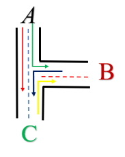
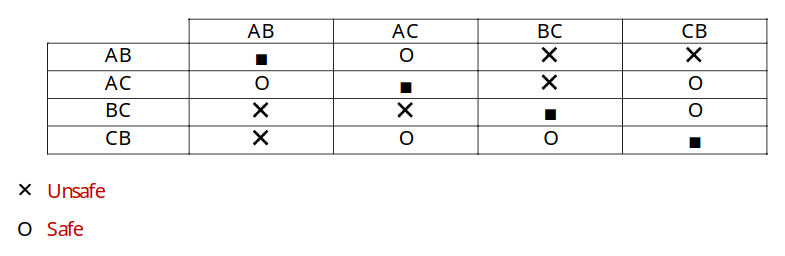
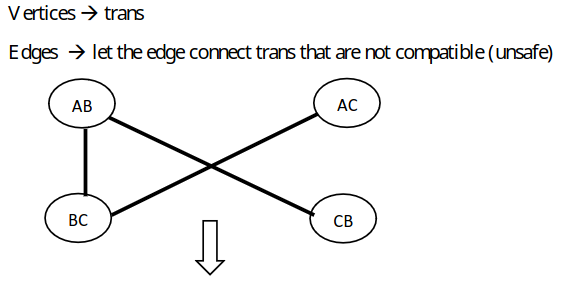
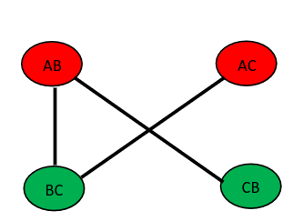
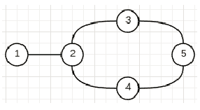
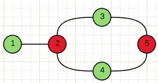
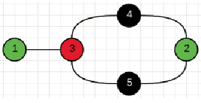
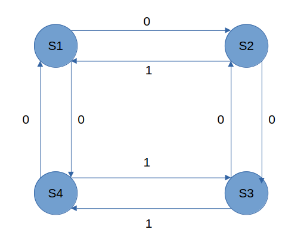
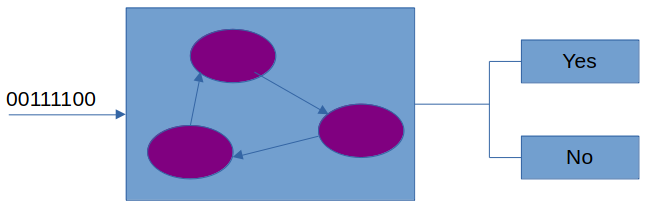
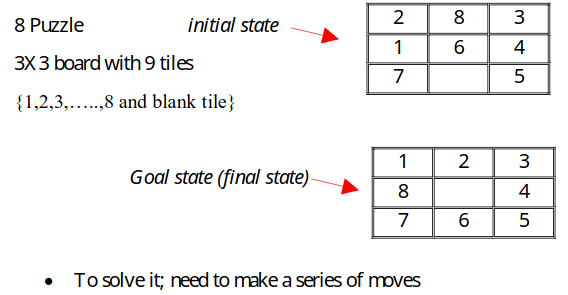

# Problem Spaces

Given an intersection:

Design a control pattern for traffic lights so that the intersection as safe as
possible.

The first thing we need to find out is which turns are compatible.

## Identify safe and unsafe turns.

|     | AB  | AC  | BC  | CB  |
| --- | --- | --- | --- | --- |
| AB  | -   | O   | X   | X   |
| AC  | O   | -   | X   | O   |
| BC  | X   | X   | -   | O   |
| CB  | X   | O   | O   | -   |

## Convert the table into a graph.

$G = <V, E>$

> What does each edge signify?

Each edge displays a pair of incompatible turns.

## Color the Graph

[Graph Coloring](https://en.wikipedia.org/wiki/Graph_coloring)

Coloring parts of a graph so that no to edges/nodes are the same color.

Picking a set of parameters that you want to prioritize and use them
efficiently.

- Greedy optimization
  - Opportunistic Approach

> How do we color the graph?

- Pick a node and color it with a new color.
- Scan the list of nodes not connected to this node and paint it with the same
  color.
  - Repeat this step until there are no more nodes that can be painted with this
    color.
- Pick up a new color and repeat 1 - 3 until you are done.

> What are some pitfalls of this greedy algorithm?

Given the following graph labeled {1 ,2, 3, 4, 5}

)

When completing the algorithm in the sequential order:

Everything turns out fine.

However, when we change the order that the notes are colored in, the minimum
number of colors cannot be achieved with the greedy approach.

Creating a formal system to analyze this process: State Spaces

## State Spaces

Capturing the condition/situation of a system at a point in time. State paces
are a representation method.

Given the graph representation of the finite state acceptor. In a device that
accepts or rejects strings.

$Q=<S_1, S_2, S_3, S_4>$

Any string that has an even number of zeroes and even number of ones, then it is
accepted. If the string contains an odd number of zeroes or odd number of ones,
then the string is not accepted.

### Example | 8-Puzzle

> Abstraction for moves

Instead of moving tiles next to the black, you move the black tile.

MOVE BLACK UP, DOWN, LEFT, RIGHT (U, D, L, R)

A solution is the sequence of moves that gives me the goal state from the
initial state.

Back to the example:

up, up, left, down, right.

### How To Do This Systematically

1. Define the state space (DB)
    - A $3\times3$ board
    $$DB = \{ T_{i,j} | T_{i,j} \in \{ 1,2,,...,8,\text{blank} | i,j = 1,2,3,4,5,6,7,8\}$$

And not true that there is: $T_{i,j} = T_{m,n} \in \{1, 2, 3\}$

> Is it possible that given a Goal and Initial state: Is it possible that there does not a exist a path to the goal state from the initial state? 

Yes, it is possible.

Operators: "Moves" that allow you to transform/transition between states.

