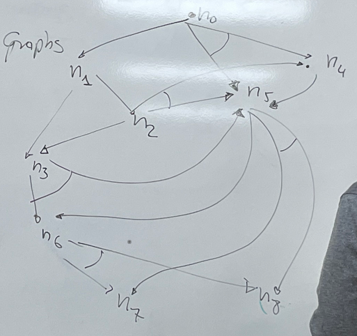
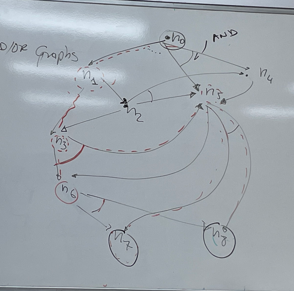
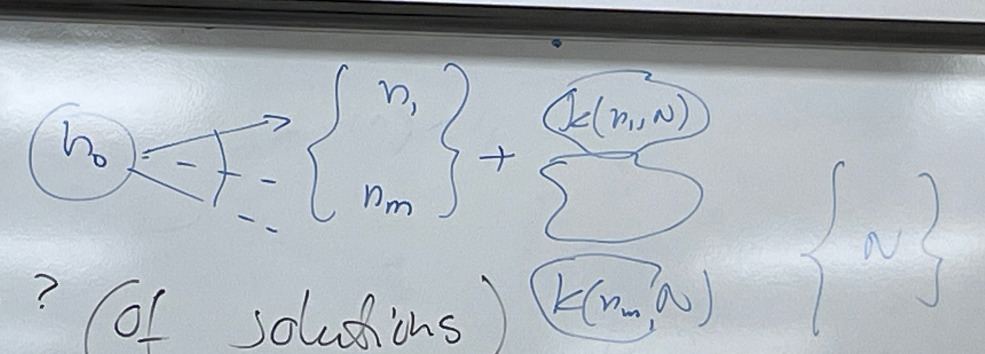
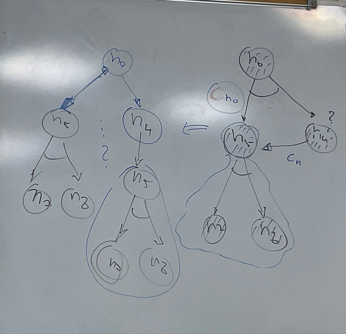
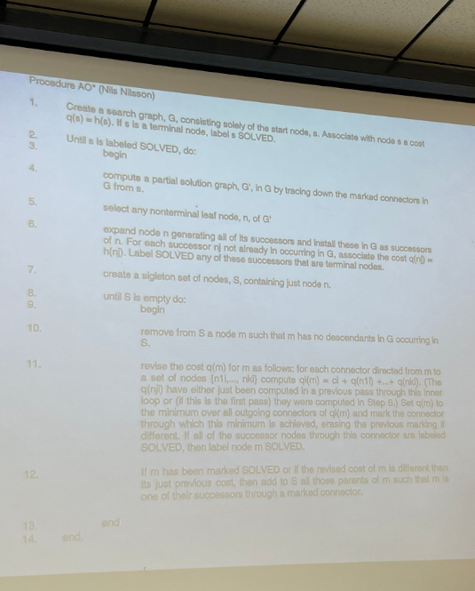
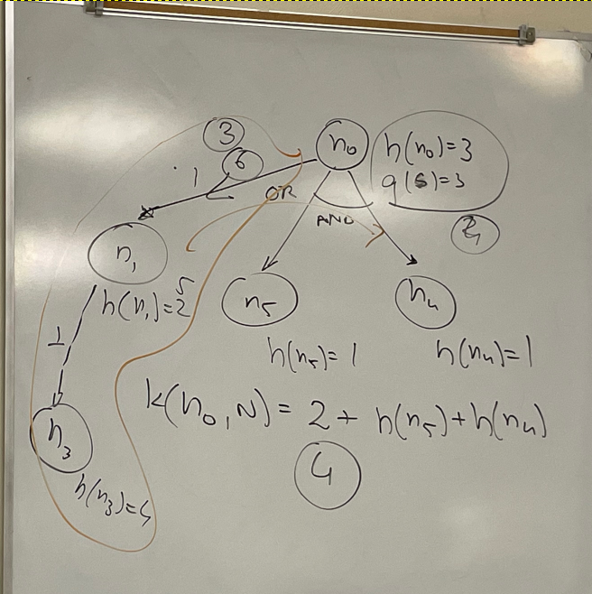

# And/Or Graphs

$$h(n_0) = 3$$ $$h(n_1) = 2$$ $$h(n_2) = 4$$ $$h(n_3) = 4$$ $$h(n_4) = 1$$
$$h(n_5) = 1$$ $$h(n_6) = 2$$ $$h(n_7) = 0$$ $$h(n_8) = 0$$

Let's assume the edges are unit cost and that the heuristic estimate for what it
would cost us to solve a sub graph.

The solution to an AND/OR graph could be a path (if there are no end
connectors), but in general, solutions are subgraphs.

## How do you get a solution?

You want to find a sub-graph from an initial node to a terminal node that is a
subgraph of the current graph.

- From $n_0$ to $N = \{n_7, n_8\}$

if $n_0 \in N$

Find a subgraph $G' \text{ of } G$ by recursively generating the following
solution.

The solution $G'$ is:

$$
n_0 \longrightarrow \begin{cases}n_1 \\ n_2 \\ ... \\ n_k \end{cases} +
\text{ the solutions from } n_0 \text { to } \{N\}
$$

Where the connection is either an edge or 2, 3, ..., n connections if there is
an AND.

Let us solve $n_0$.

$$
n_0 \rightarrow n_1 \rightarrow n_3 \rightarrow n_5\&\&\ n_6 \rightarrow n_7
\&\& n_8
$$

However, there can be multiple solutions to the same node (in this case because
there is an OR), let us solve $n_0$ again.

$$n_0 \rightarrow n_5 \&\& n_4 \rightarrow n_7 \&\& n_8$$

## How do we compute the costs of a solution?

Per the following formula:

$$k(n_0, N) = CN_{n_{0}} + k(n_1, N) + k(n_2, N) + ... + k(n_m, N)$$

$$
k(n_0, \{n_7, n_\}) = 1 + k(n_2, \{n_7, n_8\}) + 1 + 1 + k(n_3, \{n_7,
n_8\}) + 2 + 2 + k(n_6, \{n_7, n_6\}) + ...
$$

$$
k(n_0, N) = 2 + k(n_5, N) + k(n_4, N) = 2 + 2 + k(n_4, N) = 4 + k(n_4, N) =
4 + 1 + k(n_5, N) = 5 + 2 = 7
$$

