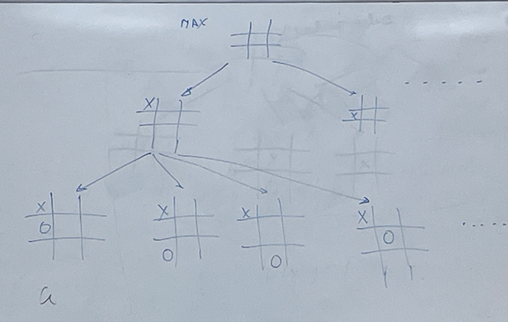
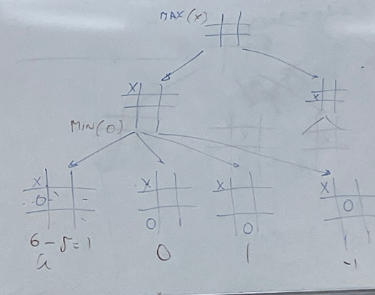
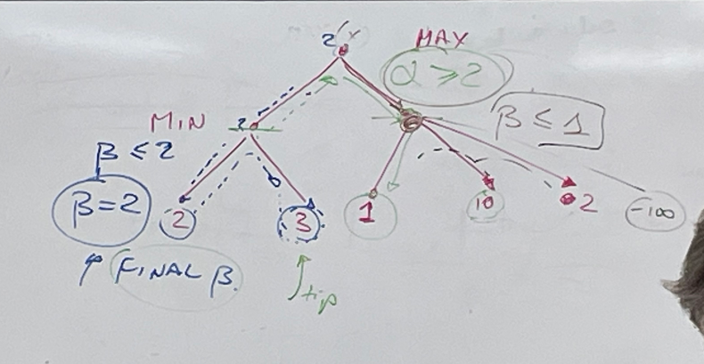
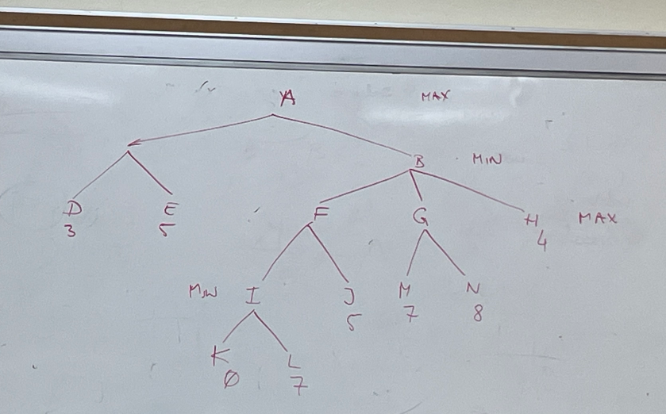
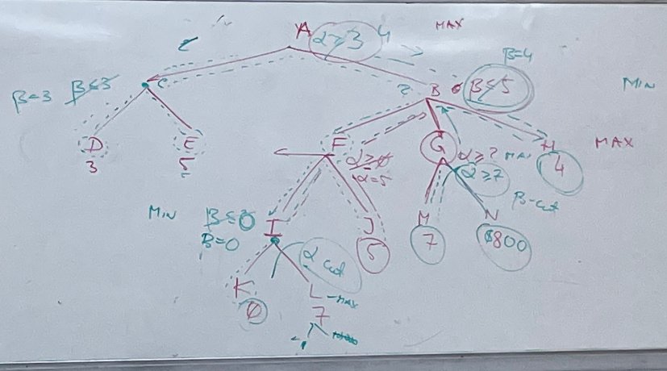

# Searching Game Trees | ECE 579

## Tic Tac Toe

Let's think about a game of tic tac toe.

The objective is to get three of a symbol in a row.

If I win, then the value of my position is infinity.

If I lose, then the value of my position is -infinity.

For any other position:

$$
e(p) = (\text{\# of rows, columns, and diagonals, open for MAX}, \text{the \#
of r, d, c, open for MIN})
$$

We can generate the game tree by creating the following moves that are possible
from the current game state.

Let us calculate the costs:

As we can see, the cost is determined from the rows that are still available to
win for the player's turn.

We know that the optimal move that a real life player would make is to place the
'o' in the center, however, our implementation scores that position very low.
This is where we begin to consider options like $\alpha-\beta$ pruning.

## $\alpha$-$\beta$ Pruning

Can we stop exploring the entire decision tree (Game Tree)?

1. Write MAX nodes we associate _lower bound_ on the position evaluation.

2. With MIN nodes, we associate _upper bound_ on the position.

### $\alpha$ - Cutoff

You can discontinue the search below any MIN node that has the $\beta \le
\alpha$ value of any of the MIN node's predecessors on the path to it.

### $\beta$ - Cutoff

You can discontinue the search below any MAX node that has $\alpha \le \beta$ of
any of the predecessors.

Here is a brief example of the cost calculations for the $\alpha$-$\beta$
cutoffs.

### Example

Given the following tree:

Check what cutoffs we can make. And then, see that the maximum payout we can get
it.

When searching all the way to the left, A->C->D->E, the final value of $\beta =
3$.

Next, searching to the right A->B->F:

Alpha is still unknown at this point.

A->B->F->I->K

We then know that the value of $\beta = 0$

At this point, should we make an $\alpha$ cutoff?

At this point we are guaranteed a $\alpha \ge 3$

Since K has a value of 0, the opposing player wouldn't let you pic the other
path even if your next move could render a larger payout. So you do not want to
pick a node that makes you lose. Therefore, we cutoff node L.

