# Lecture 1

Date: 01-11- 2024

## What is AI?

Artificial Intelligence is when an answer that the computer computes is
indistinguishable from that which gives an answer and possesses consciousness.

## The Turing Test

Are the answers that I'm getting with my interactions from the machine
indistinguishable from human answers?

## Attributes of Intelligence

Humans, who possess intelligence:

- Perceive things and events.
- Have mental states.
- Learn.
- Use language.
- Make and use models.

AI systems typically posses intelligence in isolated forms:

- Neural nets
- Planners
- etc.

## What can we do with AI?

- AI is a tool that makes a computer better at carrying out their tasks.

Example:
[Traveling Salesman Problem](https://en.wikipedia.org/wiki/Travelling_salesman_problem)

- Travel to every city at least once, ideally spending the least amount of
  resources doing so.

Nowadays the perception is that we can calculate this sort of problem with the
computers of today (iPhones, etc.)

Sure, we could throw our terabytes of data and wait two days for an answer
(especially when we need the data quick, such as when we're navigating). But AI
can help us solve these problems in a relatively short time.

## Selected Topics in Class

- State space-based search
- Knowledge representation
- Logic
- Model-based reasoning
- Planning
- Open problems (active student project participation)

## Non-Trivial Example Problems

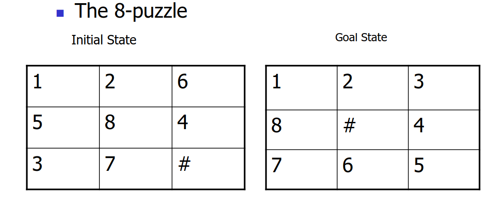

We would like to reconfigure the 8-puzzle toy so that the tiles are ordered as
shown on the right.

**How would you do this?**

We would have to come up with a representation to allow us to employ the use of
an algorithm. This would allow us to find out how to reach the goal. The next
step is a bit more difficult, we may have to find out a proper strategy.

Using **State Space** based approaches would allow us to approach a situation.

## Types of Artificial Intelligence

The artificial agents that we build perceive the environment and take action
that correspond to the environment.

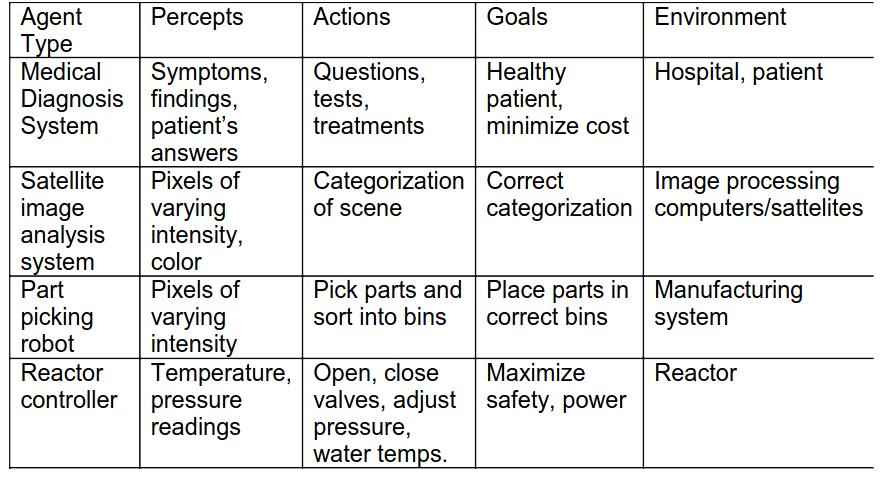

# Lecture 2

## Problem Spaces

Given an intersection:

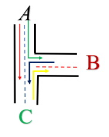

Design a control pattern for traffic lights so that the intersection as safe as
possible.

The first thing we need to find out is which turns are compatible.

## Identify safe and unsafe turns.

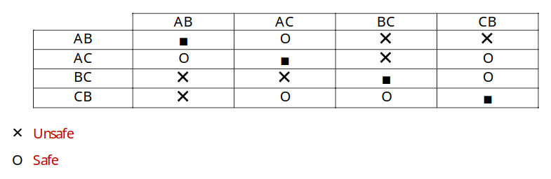

|     | AB  | AC  | BC  | CB  |
| --- | --- | --- | --- | --- |
| AB  | -   | O   | X   | X   |
| AC  | O   | -   | X   | O   |
| BC  | X   | X   | -   | O   |
| CB  | X   | O   | O   | -   |

## Convert the table into a graph.

$G = <V, E>$

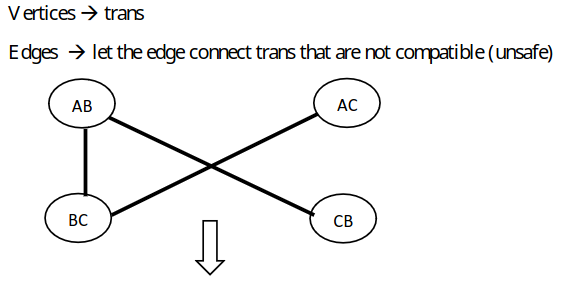

> What does each edge signify?

Each edge displays a pair of incompatible turns.

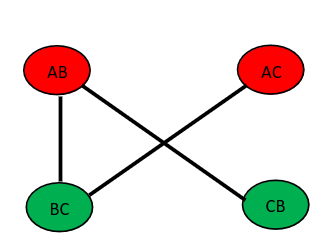

## Color the Graph

[Graph Coloring](https://en.wikipedia.org/wiki/Graph_coloring)

Coloring parts of a graph so that no to edges/nodes are the same color.

Picking a set of parameters that you want to prioritize and use them
efficiently.

- Greedy optimization
  - Opportunistic Approach

> How do we color the graph?

- Pick a node and color it with a new color.
- Scan the list of nodes not connected to this node and paint it with the same
  color.
  - Repeat this step until there are no more nodes that can be painted with this
    color.
- Pick up a new color and repeat 1 - 3 until you are done.

> What are some pitfalls of this greedy algorithm?

Given the following graph labeled {1 ,2, 3, 4, 5}

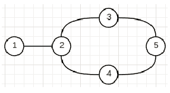)

When completing the algorithm in the sequential order:

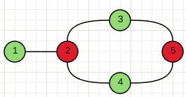

Everything turns out fine.

However, when we change the order that the notes are colored in, the minimum
number of colors cannot be achieved with the greedy approach.

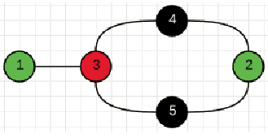

Creating a formal system to analyze this process: State Spaces

# Lecture 3

## State Spaces

[State Space search](https://en.wikipedia.org/wiki/State_space_search) is a
process used in computer science in which successive (or states) are considered,
with the intention of finding a goal state with the desired property.

Capturing the condition/situation of a system at a point in time. State paces
are a representation method.

Given the graph representation of the finite state acceptor. In a device that
accepts or rejects strings.

$Q=<S_1, S_2, S_3, S_4>$

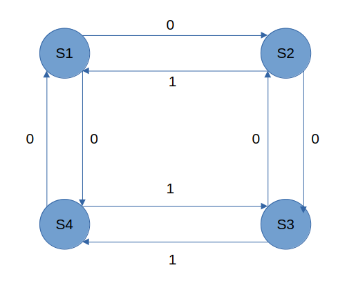

Any string that has an even number of zeroes and even number of ones, then it is
accepted. If the string contains an odd number of zeroes or odd number of ones,
then the string is not accepted.

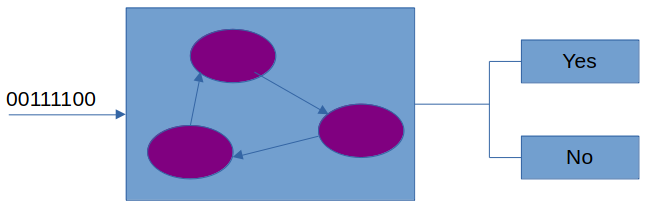

### Example | 8-Puzzle

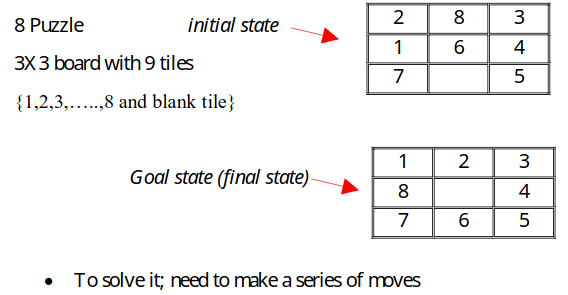

> Abstraction for moves

Instead of moving tiles next to the black, you move the black tile.

MOVE BLACK UP, DOWN, LEFT, RIGHT (U, D, L, R)

A solution is the sequence of moves that gives me the goal state from the
initial state.

Back to the example:

up, up, left, down, right.

### How To Do This Systematically

1. Define the state space (DB)
   - A $3\times3$ board $$DB = \{ T_{i,j} | T_{i,j} \in \{
     1,2,,...,8,\text{blank} | i,j = 1,2,3,4,5,6,7,8\}$$

And not true that there is: $T_{i,j} = T_{m,n} \in \{1, 2, 3\}$

> Is it possible that given a Goal and Initial state: Is it possible that there
> does not a exist a path to the goal state from the initial state?

Yes, it is possible.

Operators: "Moves" that allow you to transform/transition between states.

## AI Production System (AIPS) <-- Problem Solving Paradigm

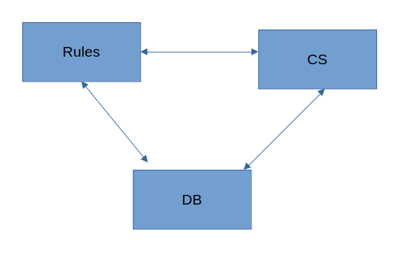

DB: Data base/state space Rules: operators that allow you to change states CS:
Control strategy

Goal state will sometimes be referred to as goal state/states/termination
condition.

> So, what are the operators of a given system?

Rules are typically given as an `if <condition> then <action>`, in terms of
state machine representation, the action that is completed when a set of
conditions is met changes the state of the system.

Control Strategies are a method that select and apply the "best" possible rule
so that a solution can be found in the most efficient way.

The possible states of a given system can be arranged into a tree. You can take
care to avoid cycles in the tree.

> Does the tree give us a solution?

Yes

> Is the solution from the tree efficient?

It is not the most efficient, but it is good enough, we cna change what we
prioritize if we're smart about it.

## Procedure Reduction

Let's take $D$ to be a state from the database.

$R$ is a rule from the set of all possible rules that apply/match to $D$.

while $R$ is not empty and $D$ does not satisfy the termination condition:

- Select a rule to apply to the database
- Apply the rule to the database
- Update the set of rules that are available

The rule that you select to perform is dependent on how "smart" you want to be
to receive the most payoff from your transformation.

### Water Jug Problem

> Given two jugs of water of capacities $<C_1, C_2>$ and no markings on them,
> how can you get precisely $<x, y>$ amounts of water in them starting with
> state $<i_1, i_2>$

For us, the following instance:

initial state: $<0,0>$

goal state: $<2,y>$, where $y$ is any amount of water $0 \le y \le 3$

> Let's use the AIPS method to approach this problem.

Such that:

$DB = \{ <x,y> | 0 \le x \le 4 \text{ and } 0 \le y \le 3 \}$

initial state: $<0,0>$

goal state: $<2,y>$, where $y$ is any amount of water $0 \le y \le 3$

**How to go about the solution?**

Control strategy

- irrevocable: you cannot take back moves, once you have conducted a
  transformation, you cannot go back.
- tentative: you try a transformation, but if you end up at a dead end, then you
  can turn back.

We could try randomly searching for a solution, but it's better to be systematic
about our approach.

Take an initial state and see what rules apply:

(0,0) --> (4,0), (0,3)

(4,0) --> (4, 3), (1, 3) (0,3) --> (4, 3), (3,0)

Eventually, you would find the solution you seek by following the nodes of this
state-tree.

# Lecture 4

01/23/2024

## Review Up to Now and Exercise

- AIPS: Production System Abstraction
- DB: Database / State space
- Operators: (Rules)
- Control Strategy

For a problem at hand, specify an initial/goal states (or conditions)

### Traveling Salesman Problem

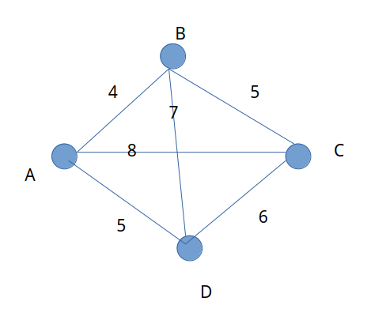

Given a set of cities and standing at city x, visit each city only once, return
to x, and minimize the distance traveled.

### Response

Assuming you can see the all of the weights that are on the graph.

Let's populate the database.

$DB$ is a list of cities visited so far. (with the condition that no city
appears twice other than the starting city)

Initially, the DB is an empty set.

Initial state <-- $DB = \{ A \}$

$S_{i} = <A>$

To get the goal state any permutation starting at $A$.

$S_{G} = <A,...,A> the list that contains all cities and A twice, the others
once, and the $\sum$ of the distance is minimal.

What are the operators that are available to us at the moment?

1. If \<possible\>, go to city $A$ next.
2. If \<possible\>, go to city $B$ next.
3. If \<possible\>, go to city $C$ next.
4. If \<possible\>, go to city $D$ next.

$S_{i} = <A>$ $S_{1} = <A, B>$ $S_{2} = <A, B, C>$ $S_{3} = <A, B, C, D>$ $S_{4}
= <A, B, C, D, A>$

One approach that we can take is the greedy algorithm approach.

In this case, (from the given graph) we can see that this would result in the
following path:

- A --> B --> D --> C --> A
  - Node Costs: 4, 5, 6, 4 = 19

## Defined Characteristics of Control Strategies

Definition of a control strategy: A process of how oyu apply the operators of
the state space in order to find a solution.

1. It should cause "motion": If the rules/operators should complete meaningful
   work done
2. The control strategy should systematic.
3. It should be efficient.

- Efficiency can be determined from the kind of solution we have. Is it optimal?

In order to find better solutions, we employ heuristic techniques.

# Lecture 5

## Efficiency of Heuristic

A principle in how your strategy works.

### Greedy Heuristics

An algorithm that guarantees optimality and is more effective than exhaustive
search.

### Branch and Bound

[Branch and Bound](https://en.wikipedia.org/wiki/Branch_and_bound) is an
algorithm/method for solving optimization problems. It works by eliminating
sub-problems that cannot be better than the optimal solution.

- Start at `A`
- Expand it to all possible nodes
- Compute the distance of all the partial solutions
- Once a solution is found, there is no need to expand any partial paths whose
  distance is greater than or equal to the current solution.

## Examples of state-space search algorithms

### Uninformed search

According to Poole and Mackworth, the following are _uninformed_ state-space
search methods, meaning that they do not have any prior information about the
goal's location.

- Depth-first search|Traditional depth-first search
- Breadth-first search
- Iterative deepening depth-first search|Iterative deepening
- Dijkstra's algorithm

### Informed search

These methods take the goal's location in the form of a heuristic function.
Poole and Mackworth cite the following examples as informed search algorithms:

- Informed/Heuristic depth-first search
- Best-first search|Greedy best-first search
- A\* search

## Classification of Control Strategies

- Irrevocable
- Tentative
  - Backtracking
  - Graph search

Example: Select an applicable rule and continue until a state is reached that
does not look promising.

You need some criteria for backtracking:

- No more rules that apply
- You explored an arbitrary number of moves and are not progressing well
- You do not want to repeat states
- Other criteria

### Graph Search

Graph Search: A control strategy that employs a particular heuristic. It is a
technique for solving problems that will employ particular heuristics.

When exploring with graph search, you begin to generate trees. When you
backtrack you only go back up to points that you have not done yet. This reduces
redundant searches.

If we're smart about the parts we expand, we can expand only parts that are
essential for solving the problem. How can we do this?

Example:

- Irrevocable

Consider the 8-puzzle and the following function:

$f(s)$ = the negative of the number of tiles that are misplaced with respect to
the goal state (the black tile is excluded from this calculation.)

# Lecture 6

Different Kinds of criteria for deciding when to backtrack:

- Dead end: I have no more rules that apply.
- Do not repeat the state on the path you are on.
- You explored "n" number of rule applications and feel you are not progressing.

# Graphs

## Depth First Search (DFS)

Pseudo Code for a DFS

```
Form a one-element queue consisting of a zero-length path that contains only the root node.

Until the first path in the queue terminates at the goal node or the queue is empty:
    Remove the first path from the queue; create new paths by extending the first path
    to all the neighbors of the terminal node.

    Reject all new paths with loops.

    Add the new paths, if any, to the *front* of the queue.

If the goal node is found, announce success; otherwise, announce failure.
```

## Breadth-first Search (BFS)

```
Form a one-element queue consisting of a zero-length path that contains only the root node.

Until the first path in the queue terminates at the goal node or the queue is empty:
    Remove the first path from the queue; create new paths by extending the first path
    to all the neighbors of the terminal node.

    Reject all new paths with loops.

    Add the new paths, if any, to the *back* of the queue.

If the goal node is found, announce success; otherwise, announce failure.
```

## Hill Climbing Search

Pseudo-code for a Hill Climb Search

```
Form a one-element queue consisting of a zero-length path that contains only the root node.

Until the first path in the queue terminates at the goal node or the queue is empty:
    Remove the first path from the queue; create new paths by extending the first path
    to all the neighbors of the terminal node.

    Reject all new paths with loops.

    Sort the new paths, if any, by the estimated distances between their terminal nodes and the goal

    Add the new paths, if any, to the *back* of the queue.

If the goal node is found, announce success; otherwise, announce failure.
```

## Branch-and-Bound Search

This algorithm searches the nodes with the least cost first. The queue is sorted
after every iteration.

```
Form a one-element queue consisting of a zero-length path that contains only the root node.

Until the first path in the queue terminates at the goal node or the queue is empty:
    Remove the first path from the queue; create new paths by extending the first path
    to all the neighbors of the terminal node.

    Reject all new paths with loops.

    Add the remaining new paths, if any, to the queue.

    Sort the entire queue by path length with the least cost path in front.

If the goal node is found, announce success; otherwise, announce failure.
```

### A-Star Search algorithm

[A-Star Search | wikipedia](https://en.wikipedia.org/wiki/A*_search_algorithm)

- $g(n)$ is the amount of effort that you have expended.
- $h(n)$ is
- $f(n) = g(n) + h(n)$

1. Start at a start node
2. Generate the children of that node
3. Pick the node with the lowest value
4. Eliminate all redundant paths to the node

[Decision Graphs](https://en.wikipedia.org/wiki/Decision_tree)

#### Example | A-Star

Recall the 8-puzzle again.


- $g(n)$: level of search tree (\# number of moves made so far.)
- $h(n)$: number of tiles in $n$ that are displaced with respect ot $g$. (do not
  count the blank).

We would like to have $h(n)$ to be an underestimate of the actual value. $h(n)
\le h^{\*}(n)$

$f(s) = g(s) + h(s)$

$f(s) = 0 + 4$


There are currently three places to move:

This results in 4 total tiles displaced from the goal state.

- Up: 4 tiles displaced from goal state.
- Left: 6 tiles displaced from goal state.
- Right: 6 tiles displaced from goal state.

We choose to continue our search using the 'Up' node.

The next level of the tree does not have 4 nodes now, it has 3. This is because
we do not want ot repeat nodes.

Now, $g(n) = 2$ because we are at the second level of the search tree.


### Facts

2. if $h(n) \le h\*$ and it meets the monotone restriction (MR) then $f(n)$ are
   non-decreasing along any path from $S$ to $G$.
3. if A\* with $h(n) \le h\*(n)$ and MR expands a node, it has already found an
   optimal path to this node.

monotone restriction: the guess for the next node to travel to does not exceed
the cost of the nodes up to this point.


