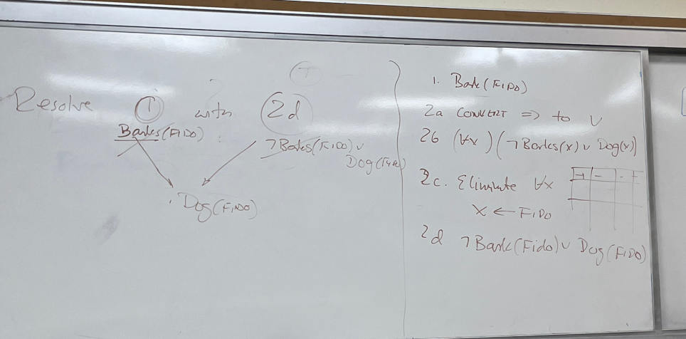

# Predicate Logic

Intro to predicate logic as a means of knowledge representation

Notation Notes:

- Typically, Dr. Rozenblit will use capital letters to describe objects in the
  real world.

- Predicates will be used to express a particular state of an object or a
  relationship between those objects.

- $z$ = logic-function($x$) will be used to say that A is a B.

Basic Definitions

- Operators
  - Negatives: $\neg, \sim$
  - And: $\wedge, &$
  - Or: $\vee$

$(A \vee B) \rightarrow F$ if A and B are false $(A \wedge B) \rightarrow T$ if
A and B are true, else false.

| A   | B   | A->B |
| --- | --- | ---- |
| T   | T   | T    |
| T   | F   | F    |
| F   | T   | T    |
| F   | F   | T    |

### Understanding The Logic Intuitive

Sentence: If I win the election, then I will lower your tuition.

> Would you agree that I'm making a promise to you?

If I pay your tuition, I have not broken my promise.

If lose and pay your tuition, I have not broken my promise.

If I win and do not pay your tuition, then I have broken my promise.

## De Morgan's Laws

Conjunction: $\neg (A\vee B) \equiv \neg A \wedge \neg B$

Disjunction/Clause Form: $\neg (A\wedge B) \equiv \neg A \ \neg B$

Properties: $\wedge$ and $\vee$ are commutative

$A \vee B \equiv B \wedge A$

Distributive:

$A \vee (B \vee C) \equiv (A \vee B) \vee C$ $A \wedge (B \wedge C) \equiv (A
\wedge B) \wedge C$

$\forall x$: for all $x$. $\exists x$: there exists an $x$

What is $\forall x P(x)$ mean?

What about $\exists x P(x)$?

$$
\forall x \text{City}(x) \Rightarrow \exists y { \text{Dogcatcher}(x, y)
\wedge \forall z { \text{Dog} (z) \wedge \text{lives in}(x,z) \Rightarrow
\text{bitten}(y,z)}}
$$

## Example

Theorem Drondy

Axioms:

1. Barks(FIDO)
2. $\forall x [Barks(x) \Rightarrow Dog(x)]$

Theorem: Dog(FIDO)

# Sound Rules of Reasoning

1. `Modus Ponens` [Modus Ponens](https://en.wikipedia.org/wiki/Modus_ponens)

If $A$ is true AND $A \Rightarrow B$ is true,

Then $B$ MUST FOLLOW.

1. BARKS(FIDO)

2a. $\forall x : x \Leftarrow FIDO$ Eliminate $\forall X$

2b. BARK(FIDO) $\Rightarrow$ DOG(FIDO)

The DOG(FIDO) MUST BE TRUE.

# Resolution

Two Clauses

$A \vee B$

$\neg B \vee C$

$\rightarrow A \vee C$ (resolvent)

# Modus Ponens

1. $E_{1}$
2. $E_{1} \Rightarrow E_{2}$

Then $E_{2}$ follows.

Converting the bod theorem from axiom form andput it into predicate logic form:

1. Barks(FIDO)
2. $\forall x [Barks(x) \Rightarrow Dog(x)]$

Theorem: Dog(FIDO)

1. Bard(FIDO)
2. Convert $\Rightarrow$ to $\vee$
3. $(\forall x)$ ($\neg$ Barks(x)) $\vee$ Dog(x)

Equivalence Theorem:

$A \Rightarrow B = (\neg A \vee B)$

"A implies B is equivalent to not A or B"

## Proving Properties by refutation using resolution

1. Given a list of Axioms + Theorem
2. Convert them to clause form
3. Negate the theorem
4. Attach negated theorem to the list of Axioms in clause form.
5. Resolve until NIL or empty clause

Notes: the theorem has to be in a disjuctive form.

Analogy:

$A \vee B$, $A \vee \neg B$, $Q \vee C \vee \neg Y$, $\neg X \vee Y$

$A$, $Q \vee C \vee \neg X$

After resolving the statements above, we can make another list of theorems that
can then continue to be resolved until a NIL clause is formed.

## Example

Given the theorem:

1. Barks(FIDO)
2. $\forall x$ (Barks(x) $\Rightarrow$ Doc(x))
3. Prove Th: Dog(FIDO)

Solving:

Leave (1) as is:

1. Barks(FIDO)

Negate (2)

2. $\forall x$ (Barks(x) $\Rightarrow$ Doc(x))

$\neg$ Bark(FIDO) $\vee$ Dog(FIDO)

3. $\neg$ Dog(FIDO)

<!-- TODO -->
